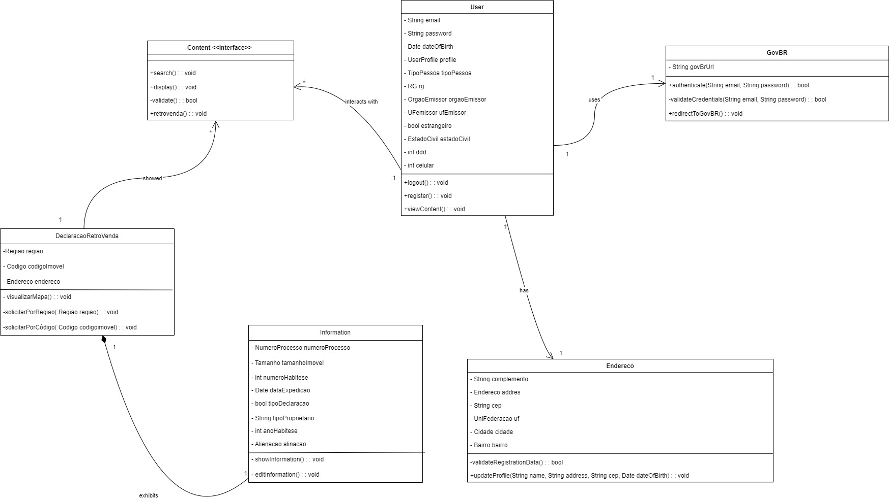
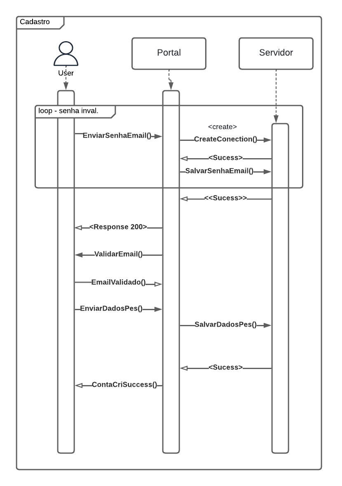
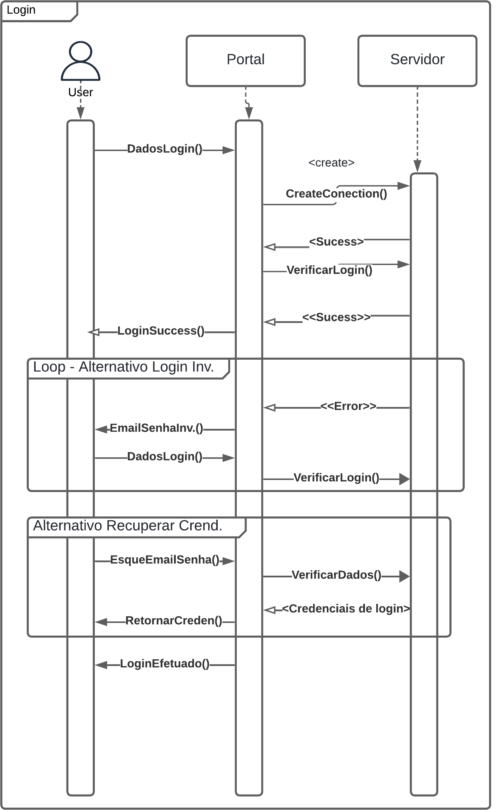
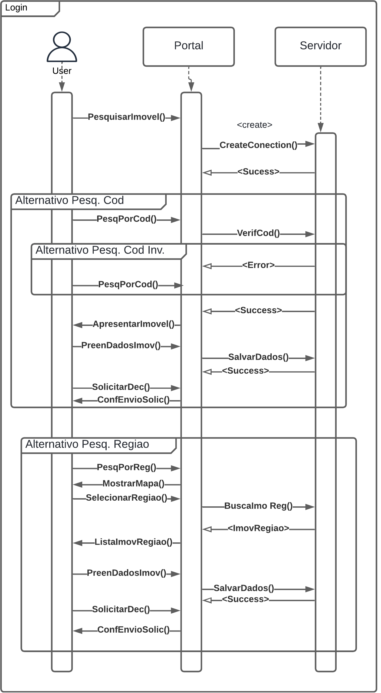
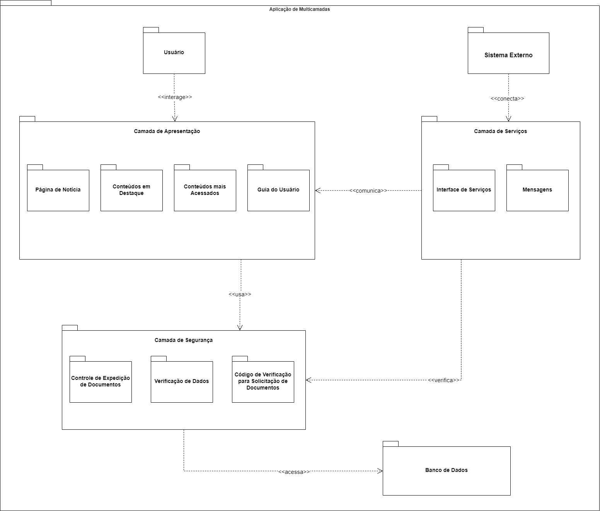

# <a> *Visão Lógica* </a>

## <a>*Introdução*</a>

A Visão Lógica é pensada para atender as necessidades e preocupações do usuário final, sendo pautada nos conceitos de orientação a objetos. Esse conceito é discutido amplamente no modelo 4+1 de Philippe Kruchten, onde a Visão Lógica é uma das principais visões que ajudam na organização e estruturação de sistemas complexos através da perspectiva do desenvolvedor e do usuário final (Kruchten, 1995).

## <a>*Metodologia*</a>

A visão lógica foi realizada pelos integrantes associados à atividade: [Gabriel Campello Marques](https://github.com/G16C), [Arthur Grandão de Mello](https://github.com/arthurgrandao) e [Rafael Ferreira Leandro](https://github.com/RafaelCLG0). A seleção dos integrantes foi feita considerando a participação anterior de cada um nos diagramas de Classe, Pacotes e Sequência. Esses diagramas passaram por mudanças com base no feedback fornecido na entrega anterior, que abordava a modelagem de um sistema específico com foco nos fluxos de Cadastro/Login, .

A divisão das responsabilidades para a discussão detalhada sobre a visão lógica de cada artefato foi baseada na afinidade de cada integrante com seu respectivo diagrama. Desta forma, Arthur Grandão de Mello ([arthurgrandao](https://github.com/arthurgrandao)) pelo Diagrama de Classes, Gabriel Campello Marques ([G16C](https://github.com/G16C)) ficou responsável pelo Diagrama de Pacotes e Rafael Ferreira Leandro ([RafaelCLG0](https://github.com/RafaelCLG0)) pelo Diagrama de Sequência.

O estudo individual sobre as visões DAS foi conduzido antes da reunião, que ocorreu em 15 de agosto de 2024 no ambiente do Discord, às 16h50. Essa reunião teve como objetivo alinhar as atividades, esclarecendo as mudanças feitas nos diagramas e garantindo que todos os diagramas estivessem coerentes e alinhados em termos de informações. Importante mencionar que os diagramas foram corrigidos utilizando a ferramenta Draw.io. O alinhamento foi essencial para que os integrantes pudessem compreender a situação de cada diagrama e realizar ajustes, caso necessário.

## <a>*Diagrama de Classes*</a>

Um diagrama de classe mostra um conjunto de classes, interfaces e colaborações e seus relacionamentos. Esses diagramas são os diagramas mais comuns encontrados na modelagem de sistemas orientados a objetos. Os diagramas de classe abordam a visão de design estático de um sistema. Os diagramas de classe que incluem classes ativas abordam a visão de processo estático de um sistema. Os diagramas de componentes são variantes dos diagramas de classe (Booch, 2005).

Figura 1 - Diagrama de Classes

     

Fonte: <a>[Yankee](../../Subgrupos/Yankee.md)</a>, 2024

O diagrama de classes representa o sistema de solicitação de retrovenda de imóveis da Terracap. O usuário pode se registrar e autenticar via GovBR e interagir com o conteúdo relacionado à retrovenda através da interface. O diagrama reflete a estrutura e a lógica necessárias para implementar essa funcionalidade no sistema.

Para visualizar o diagrama em mais detalhes, acesse a sua respectiva página: [Diagrama de Classes](../../Modelagem/ModelagemEstatica/DiagramaDeClasses.md).

## <a>*Diagrama de Sequência*</a>

O Diagrama de Sequência representa a interação entre objetos ao longo do tempo, mostrando a troca de mensagens entre eles para realizar uma funcionalidade específica. Essencial para entender a dinâmica do sistema, este diagrama permite visualizar como os objetos colaboram para realizar processos ou funcionalidades específicas. Ele complementa a visão estática, oferecendo uma perspectiva temporal das interações. (Booch, 2005)

Os diagramas de sequências abaixo estão mais detalhado em sua respectiva página [Diagrama de Sequências](../../Modelagem/ModelagemDinamica/DiagramaDeSequencia.md).

Figura 2 - Fluxo de Cadastro

Fonte: <a>[Foxtrot](../../Subgrupos/Foxtrot.md)</a>, 2024

Esse diagrama de sequência representa o fluxo de um processo de cadastro de usuário em um sistema, envolvendo três participantes: o Usuário, o Portal e o Servidor. Onde o usuário solicita o envio de uma senha por e-mail. O portal valida o e-mail, cria uma conexão com o servidor e salva a senha e os dados pessoais do usuário. Após cada etapa bem-sucedida, o servidor confirma a operação, e o portal informa ao usuário o sucesso da criação da conta. Caso a senha seja inválida, o processo repete até que seja válida. 

Figura 3 - Fluxo de Login

Fonte: <a>[Foxtrot](../../Subgrupos/Foxtrot.md)</a>, 2024

Este diagrama de sequência representa o fluxo de login de um usuário no sistema. O usuário envia seus dados de login, que são verificados pelo servidor via o portal. Se o login for bem-sucedido, o usuário é autenticado. Caso contrário, o sistema entra em um loop onde o usuário tenta novamente até o login ser bem-sucedido ou alterna para a recuperação de credenciais, enviando um e-mail para redefinir a senha. Após a verificação dos dados recuperados, o usuário é autenticado e o login é efetuado com sucesso.

Figura 4 - Fluxo de Declaração de Retrovenda

</img>

Fonte: <a>[Foxtrot](../../Subgrupos/Foxtrot.md)</a>, 2024

Este diagrama de sequência descreve o processo de pesquisa e solicitação de um imóvel no sistema. O usuário inicia a pesquisa de um imóvel, que pode ser feita por código ou por região. No caso da pesquisa por código, o sistema verifica a validade do código e, se for válido, apresenta o imóvel e permite que o usuário solicite uma decisão. Caso o código seja inválido, o usuário é redirecionado para corrigir a pesquisa. Na pesquisa por região, o sistema exibe um mapa para seleção da região, busca os imóveis correspondentes, e o usuário pode então selecionar o imóvel desejado e enviar a solicitação. O servidor confirma as operações com mensagens de sucesso ao longo do processo.

## <a>*Diagrama de Pacotes*</a>

Segundo (2005, Booch) o diagrama de pacotes é discutido como um elemento crucial na visão lógica de um sistema, especialmente em termos de organização e modularização do sistema. O diagrama de pacotes é utilizado para organizar e estruturar grandes sistemas, ajudando a dividir a complexidade do sistema em partes menores e mais gerenciáveis. Cada pacote pode conter classes, interfaces, ou até mesmo outros pacotes, e as dependências entre esses pacotes são representadas por setas direcionais.

Figura 5 - Diagrama de Pacotes

    

Fonte: <a>[Yankee](../../Subgrupos/Yankee.md)</a>, 2024

Para uma melhor compreensão do Diagrama de Pacotes o link a seguir leva ao documento original [Diagrama de Pacotes](../../Modelagem/ModelagemEstatica/DiagramaDePacotes.md)
## <a>*Diagrama de Comunicação*</a>

No livro The Unified Modeling Language User Guide, o diagrama de comunicação (também conhecido como diagrama de colaboração na versão original do UML) é descrito como uma ferramenta fundamental na captura da visão lógica de um sistema. O diagrama de comunicação representa o fluxo de mensagens entre os objetos para realizar uma operação ou processo específico. Ele difere do diagrama de sequência, que também é um diagrama dinâmico, principalmente no foco que dá à estrutura e à organização dos objetos envolvidos na interação, em vez da ordem temporal das mensagens.

## <a>*Bibliografia*</a>

> KRUCHTEN, Philippe. Architectural Blueprints — The “4+1” View Model of Software Architecture. IEEE Software 12 (6), pp. 42-50, 1995. Disponível em: https://www.cs.ubc.ca/~gregor/teaching/papers/4+1view-architecture.pdf. Acesso em: 15 de agosto de 2024 às 16:00.

> BOOCH, Grady; RUMBAUGH, James; JACOBSON, Ivar. The Unified Modeling Language User Guide. 2ª ed. Addison-Wesley, 2005. Disponível em: https://www.pearson.com/store/p/unified-modeling-language-user-guide-the/P100000486863/9780321267979. Acesso em: 15 de agosto de 2024 às 15:00.

## <a>*Histórico de Versão*</a>

Favor não copiar o histórico de versão dobrado, essa seção é apenas para rastrear o template de artefato

| Versão |    Data    |       Descrição       |                    Autor(es)                     |              Revisor(es)              |
| :----: | :--------: | :-------------------: | :----------------------------------------------: | :-----------------------------------: |
| `1.0`  | 15/08/2024 |  Criação do artefato  |       [Yankee](../../Subgrupos/Yankee.md)        | [Whiskey](../../Subgrupos/Whiskey.md) |
| `1.1`  | 15/08/2024 | Correções de conteudo |         [Papa](../../Subgrupos/Papa.md)          | [Foxtrot](../../Subgrupos/Foxtrot.md) |
| `1.2`  | 15/08/2024 |  Correções de padrão  | [João Lucas](https://github.com/VasconcelosJoao) |  [Yankee](../../Subgrupos/Yankee.md)  |

