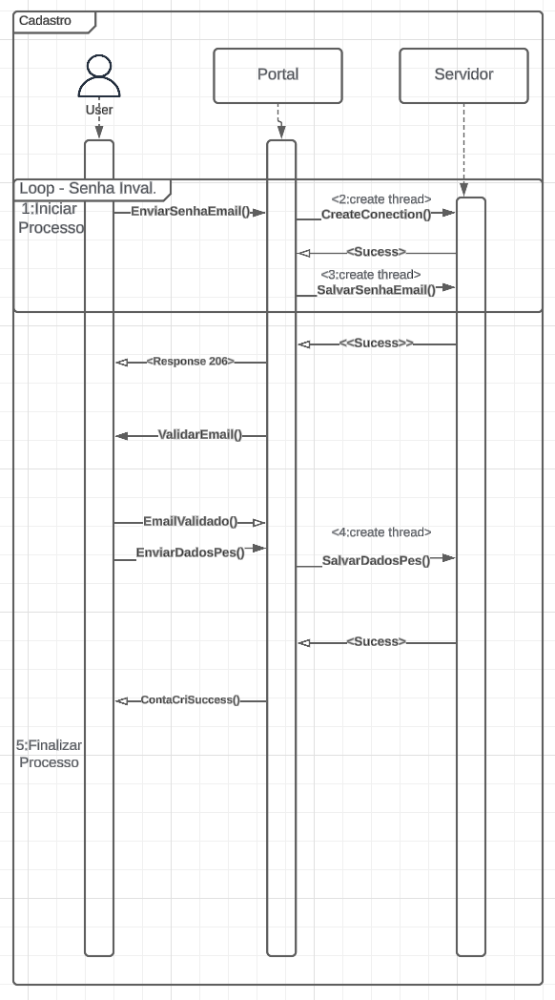
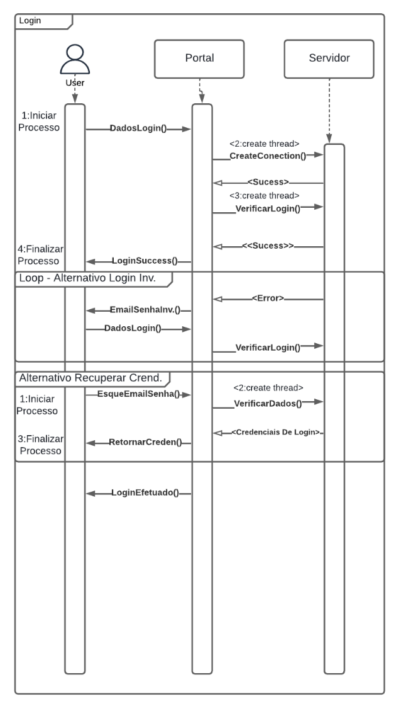
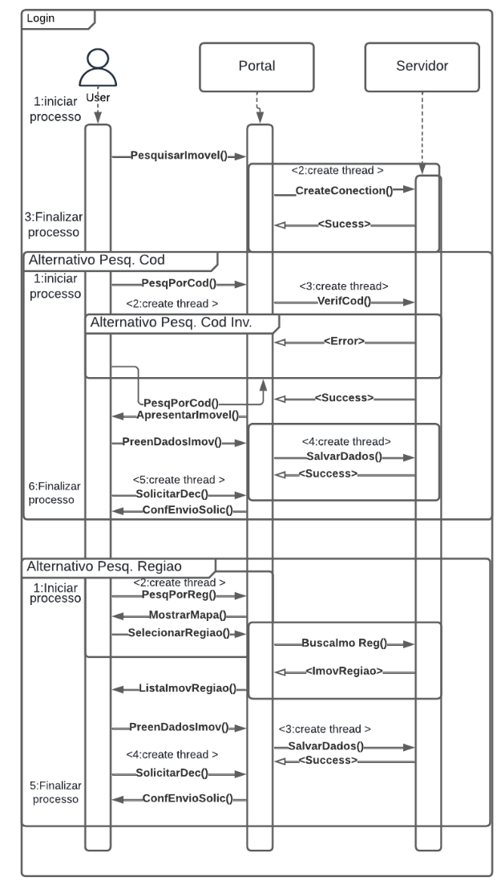
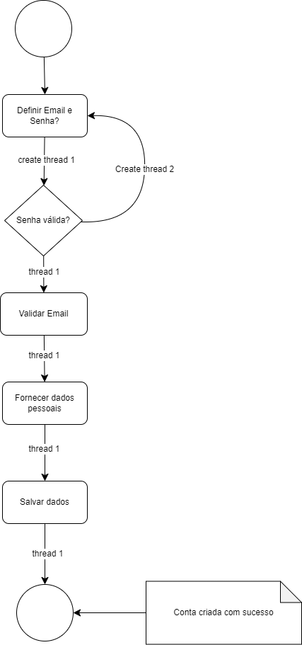
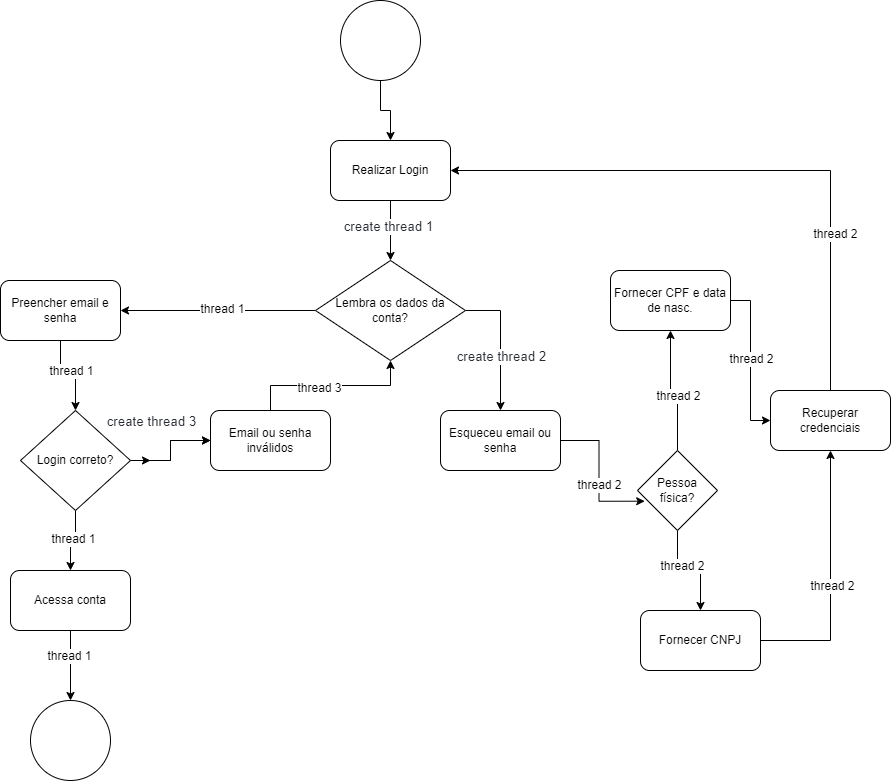

# <a>*<a> *Visão Processos* </a>*</a>

## <a>*Introdução*</a>
Um padrão arquitetural é um conjunto de princípios de design que direcionam a organização de um sistema, facilitando a manutenção, escalabilidade, e desempenho. Entre os diversos estilos arquiteturais disponíveis, o padrão de processo é mais utilizado para modelar e gerenciar a execução de fluxos de trabalho complexos, garantindo que múltiplas tarefas possam ser processadas de maneira eficiente e escalável. (Garlan e Shaw, 1994)

O padrão de processo é particularmente útil em sistemas que exigem uma gestão precisa de transações, paralelismo e resposta em tempo real. Ele promove a separação de responsabilidades e a modularidade, permitindo que diferentes processos ou threads sejam executados simultaneamente, sem a necessidade de esperar que outras operações sejam concluídas, otimizando o uso dos recursos do sistema.

## <a>*Metodologia*</a>

A visão de Processos foi efetuada pelos integrantes [Paulo Victor Fonseca](https://github.com/PauloVictorFS), [Arthur Marmo Cathalá](https://github.com/artmarmocathala), e [Renann de Oliveira Gomes](https://github.com/NyndoND) do subgrupo [Foxtrot](../../Subgrupos/Foxtrot.md). O subgrupo se reuniu em uma chamada de grupo, na plataforma Discord, no dia 15 de agosto, por volta das 11h. Além do Discord, para a criação do diagrama, foi feita a utilização do Lucidchart, e para a escrita do documento, o VSCode com sua extensão Live Share.

 O artefato foi feito adaptando o [Diagrama de Sequencia](../../Modelagem/ModelagemDinamica/DiagramaDeSequencia.md) e o [Diagrama de Atividade](../../Modelagem/ModelagemDinamica/DiagramaDeAtividades.md) colocando foco nas comunicações entre processos e os principais modos de interação, como passagem de mensagens e interrupções (threads). Para isso, é importante  Focar nos processos do sistema, mapeando-os em threads ou processos concorrentes para otimização, identificando  nesses diagramas tarefas que são independentes e podem ser paralelizadas para melhorar o desempenho, e por fim adaptando os diagramas para que cada tarefa ou processo seja mapeado para uma thread.

## <a>*Diagrama de Sequência*</a>
Para cada um dos diagramas de sequência a seguir, foram adicionados threads em tarefas que são independentes e podem ser paralelizadas, de tal forma que todos os processos e threads foram numerados para se ter uma noção da linearidade.

    

Nesse primeiro diagrama foi-se criado o processo principal do cadastro desde a função enviarSenhaEmail() até finalizar o processo de cadastro e a conta sendo finalizada com sucesso, e as threads criadas foram uma para criar conexão (CreateConnection()) para não bloquear a interface do usuário, e  outra que enquanto está conectando já irá iniciar o salvamento das informações cadastradas pelo usuario, e por fim outra thread para salvar os  dados pessoais. vale destacar que há um pequeno delay para uma thread não depender de outra em caso por exemplo como o da conexão

    

Nesse segundo diagrama foi-se criado dois processos principais do login: Um para realizar o login do usuario, e um para recuperar as credenciais do usuario caso ele esqueça alguma informação importante, no primeiro processo há uma thread de criar conexão (CreateConnection()) para não bloquear a interface do usuário e uma de verificar login, enquanto que no segundo processo há um de verificar dados. vale destacar que há um pequeno delay para uma thread não depender de outra em caso por exemplo como o da conexão

    

Nesse ultimo diagrama foi-se criado três processos principais para a retrovenda. Um para iniciar o processo de pesquisa com a para criar conexão (CreateConnection()) para não bloquear a interface do usuário, e enquanto isso há dois processos que podem ocorrer também, um para pesquisar por código, e outro para pesquisar por região. Em ambos os casos há uma thread para a parte de pesquisa, outro para salvar dados, e outra pra solicitar a declaração do imóvel

## <a>*Diagrama de Atividades *</a>

No diagrama de Atividades foram adicionadas threads as atividades que dependem que outra atividada seja concluída, a thread principal está representada como thread 1

    

No diagrama de Login é possível ver os processos que são iniciados, de acordo com cada tomada de decisão do fluxo.

    4

Uma coisa parecida ao diagrama de Login acontece, contudo, podemos ver que alguma threads podem ficar em "espera" até que threads secundárias sejam concluídas, para que o sistema possa então possuir as informações necessárias para seguir com o andamento da thread principal (sendo representada aqui como thread 1).

## <a>*Bibliografia*</a>
    
    SERRANO. MILENE, AULA - ARQUITETURAS & DA - PARTE II, 2024. Diponível em: https://aprender3.unb.br/pluginfile.php/2790287/mod_label/intro/Arquitetura%20e%20Desenho%20de%20Software%20-%20Aula%20Arquitetura%20e%20DAS%20-%20Parte%20II%20-%20Profa.%20Milene.pdf

    Garlan, D., & Shaw, M. (1994). An Introduction to Software Architecture. Pittsburgh: School of Computer Science, Carnegie Mellon University.

    

## <a>*<a>*Histórico de Versão*<a>*</a>

| Versão |    Data    |      Descrição       |                    Autor(es)                     |              Revisor(es)              |
| :----: | :--------: | :------------------: | :----------------------------------------------: | :-----------------------------------: |
| `1.0`  | 15/08/2024 | Criação do documento |      [Foxtrot](../../Subgrupos/Foxtrot.md)       | [Whiskey](../../Subgrupos/Whiskey.md) |
| `1.1`  | 15/08/2024 | Correção das imagens |       [Yankee](../../Subgrupos/Yankee.md)        |    [Papa](../../Subgrupos/Papa.md)    |
| `1.2`  | 15/08/2024 |  Correção do Padrão  | [João Lucas](https://github.com/VasconcelosJoao) | [Foxtrot](../../Subgrupos/Foxtrot.md) |

