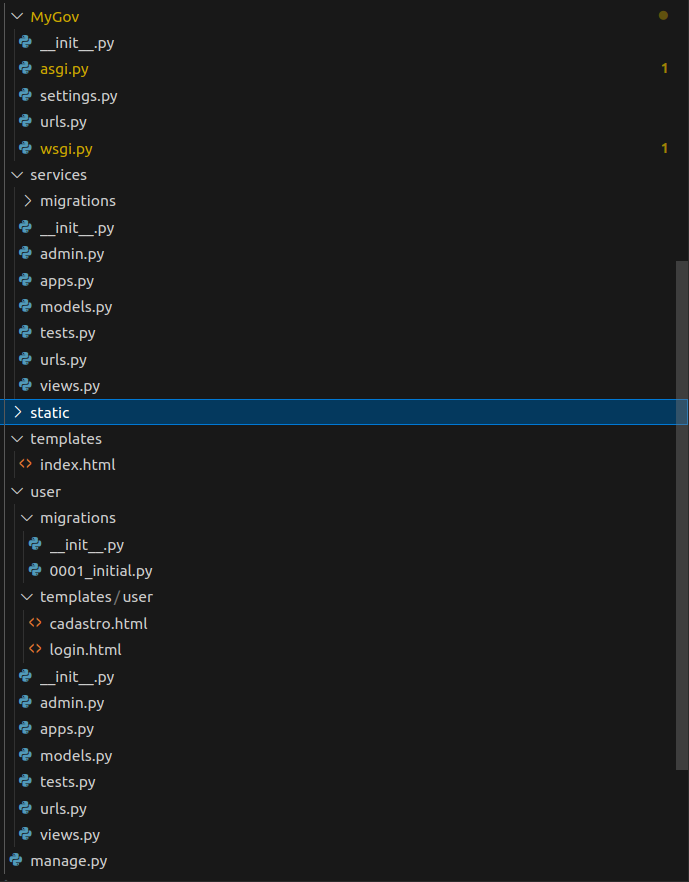

# Reutilização de Software

## Introdução

Nesse artefato será evidenciado as práticas de reutilização de software utilizadas na construção da aplicação MyGov, baseada no site da Terracap e em suas funcionalidades. O objetivo da reutilização de software é diminuir o tempo de desenvolvimento do projeto ao utilizar frameworks e códigos já desenvolvidos para serem empregados em funcionalidades da aplicação.

## Metodologia

Para o desenvolvimento desse aspecto do projeto, foi realizada uma reunião com os membros do grupo [Whiskey](../../Subgrupos/Whiskey.md) em que algumas funcionalidades acerca do desenvolvimento do MVP são divididas. Nessa divisão, o integrante Vitor Borges ficou encarregado da elaboração da interface de interação com o usuário, enquanto João Pedro e Leonardo Gonçalves ficaram responsáveis por elaborar o banco de dados e a camada de modelos relativas à funcionalidade. A gravação da reunião está disponível [aqui](https://youtu.be/VsGrw-lxeco).

## Reutilização

### Django

O framework utilizado para a elaboração da interface gráfica foi o Django, da linguagem Python. Abaixo está a estrutura de arquivos gerada pelo framework:



Os arquivos mais relevantes nesse contexto são [urls.py](../../../MyGov/MyGov/urls.py), [settings.py](../../../MyGov/MyGov/settings.py) e [models.py](../../../MyGov/services/models.py).

### urls.py

Nesse arquivo, são definidas os paths da aplicação. Na parte de reutilização de código temos as bibliotecas django.contrib e django.urls

```python
from django.contrib import admin
from django.urls import include, path

urlpatterns = [
    path("", include("services.urls")),
    path("admin/", admin.site.urls),
    path("user/", include("user.urls")),
]
```

### settings.py

Nesse arquivo, são definidas as componentes e bibliotecas necessárias para o framework funcionar adequadamente.

```python
"""
Django settings for MyGov project.

Generated by 'django-admin startproject' using Django 5.0.7.

For more information on this file, see
https://docs.djangoproject.com/en/5.0/topics/settings/

For the full list of settings and their values, see
https://docs.djangoproject.com/en/5.0/ref/settings/
"""

import os

BASE_DIR = os.path.dirname(os.path.dirname(os.path.abspath(__file__)))


# Quick-start development settings - unsuitable for production
# See https://docs.djangoproject.com/en/5.0/howto/deployment/checklist/

# SECURITY WARNING: keep the secret key used in production secret!
SECRET_KEY = 'django-insecure-(m=c-8$x^0x_sm#%l@vch!i^heeksov%wi7=_k&vdlm3s9_xc='

DEBUG = True

ALLOWED_HOSTS = []

# Application definition

INSTALLED_APPS = [
    'django.contrib.admin',
    'django.contrib.auth',
    'django.contrib.contenttypes',
    'django.contrib.sessions',
    'django.contrib.messages',
    'django.contrib.staticfiles',
    'services',
    'user',
]

MIDDLEWARE = [
    'django.middleware.security.SecurityMiddleware',
    'django.contrib.sessions.middleware.SessionMiddleware',
    'django.middleware.common.CommonMiddleware',
    'django.middleware.csrf.CsrfViewMiddleware',
    'django.contrib.auth.middleware.AuthenticationMiddleware',
    'django.contrib.messages.middleware.MessageMiddleware',
    'django.middleware.clickjacking.XFrameOptionsMiddleware',
]

ROOT_URLCONF = 'MyGov.urls'

TEMPLATES = [
    {
        'BACKEND': 'django.template.backends.django.DjangoTemplates',
        'DIRS': [os.path.join(BASE_DIR, 'templates')],
        'APP_DIRS': True,
        'OPTIONS': {
            'context_processors': [
                'django.template.context_processors.debug',
                'django.template.context_processors.request',
                'django.contrib.auth.context_processors.auth',
                'django.contrib.messages.context_processors.messages',
            ],
        },
    },
]

WSGI_APPLICATION = 'MyGov.wsgi.application'


# Database
# https://docs.djangoproject.com/en/5.0/ref/settings/#databases

DATABASES = {
    'default': {
        'ENGINE': 'django.db.backends.sqlite3',
        'NAME': os.path.join(BASE_DIR, 'db.sqlite3'),
    }
}


# Password validation
# https://docs.djangoproject.com/en/5.0/ref/settings/#auth-password-validators

AUTH_PASSWORD_VALIDATORS = [
    {
        'NAME': 'django.contrib.auth.password_validation.UserAttributeSimilarityValidator',
    },
    {
        'NAME': 'django.contrib.auth.password_validation.MinimumLengthValidator',
    },
    {
        'NAME': 'django.contrib.auth.password_validation.CommonPasswordValidator',
    },
    {
        'NAME': 'django.contrib.auth.password_validation.NumericPasswordValidator',
    },
]


# Internationalization
# https://docs.djangoproject.com/en/5.0/topics/i18n/

LANGUAGE_CODE = 'en-us'

TIME_ZONE = 'UTC'

USE_I18N = True

USE_TZ = True


# Static files (CSS, JavaScript, Images)
# https://docs.djangoproject.com/en/5.0/howto/static-files/

STATIC_URL = 'static/'

# Default primary key field type
# https://docs.djangoproject.com/en/5.0/ref/settings/#default-auto-field

DEFAULT_AUTO_FIELD = 'django.db.models.BigAutoField'

AUTH_USER_MODEL = 'user.User'

```
### models.py

Esse arquivo define as classes da modelagem do nosso banco de dados relacional implementado com o Django. Foram utilizadas as bibliotecas django.db e user.models.

```python
from django.db import models
from user.models import User

# Model Endereco
class Endereco(models.Model):
    complemento = models.CharField(max_length=255)
    address = models.CharField(max_length=255)
    cep = models.CharField(max_length=10)
    uf = models.CharField(max_length=2)
    cidade = models.CharField(max_length=100)
    bairro = models.CharField(max_length=100)
    user = models.ForeignKey(User, related_name='enderecos', on_delete=models.CASCADE)

    def validate_registration_data(self):
        pass  # implementar lógica

    def update_profile(self, name, address, cep, date_of_birth):
        pass  # implementar lógica

# Model Information -> TALVEZ SEJA MELHOR COMO UMA VIEW
class Information(models.Model):
    numero_processo = models.CharField(max_length=50)
    tamanho_imovel = models.CharField(max_length=50)
    numero_habite_se = models.IntegerField()
    data_expedicao = models.DateField()
    tipo_declaracao = models.BooleanField(default=False)
    tipo_proprietario = models.CharField(max_length=50)
    ano_habite_se = models.IntegerField()
    alienacao = models.CharField(max_length=255)

    def show_information(self):
        pass  # implementar lógica

    def edit_information(self):
        pass  # implementar lógica


# Model DeclaracaoRetroVenda herdando Content
class DeclaracaoRetroVenda(models.Model):
    regiao = models.CharField(max_length=100)
    codigo_imovel = models.CharField(max_length=100)
    endereco = models.ForeignKey(Endereco, on_delete=models.CASCADE)
    information = models.OneToOneField(Information, on_delete=models.CASCADE)

    def visualizar_mapa(self):
        pass  # implementar lógica

    def solicitar_por_regiao(self, regiao):
        pass  # implementar lógica

    def solicitar_por_codigo(self, codigo_imovel):
        pass  # implementar lógica


```

### Outros arquivos
Por ser um framework com muitas funcionalidades, existem outros arquivos que utilizam bibliotecas Django para o funcionamento da aplicação desenvolvida. Porém, os arquivos listados acima e suas bibliotecas são os mais relevantes para compreender o funcionamento.

### API IBGE

Para buscar informações sobre as regiões administrativas e podemos marcar as mesmas no mapa utilizamos a API gratuita do [IBGE](https://servicodados.ibge.gov.br/api/docs/localidades/estados/DF/localidades?versao=2.0), nela é possível buscar por código, nome, estado e região administrativa para popular os formulários e facilitar a vida do usuário.

### Geolocalização

Dentro da plataforma é possível selecionar endereços a partir de um mapa, para implementar isso no nosso projeto, utilizamos a biblioteca [Leaflet](https://leafletjs.com/) para renderizar mapas interativos em conjunto com a [OpenStreetMap](https://www.openstreetmap.org/) para buscar coordenadas a partir do nome de uma localidade. Desta forma foi possível integrar a feature do usuário buscar o endereço marcando um ponto no mapa.

## Fluxo de funcionalidade

Para ter acesso aos serviços o usuário deve possuir uma conta em nossa plataforma, para isso primeiro é necessário realizar o cadastro, assim que o usuário se cadastra o login é feito de forma automática e o usuário é redirecionado para a página inicial. A partir disso ele pode acessar livremente a área de serviços.

[Veja o vídeo do fluxo](https://www.youtube.com/watch?v=KyP4vRuc5qU)


## <a>*Histórico de Versão*</a>

| Versão |    Data    |       Descrição       |               Autor(es)               |                   Revisor(es)                    |
| :----: | :--------: | :-------------------: | :-----------------------------------: | :----------------------------------------------: |
| `1.0`  | 15/08/2024 | Confecção do artefato | [Whiskey](../../Subgrupos/Whiskey.md) |        [Papa](../../Subgrupos/Papa.md)        |
| `1.1`  | 16/08/2024 | Adição de API e Geolocalização | [Whiskey](../../Subgrupos/Whiskey.md) |        [Papa](../../Subgrupos/Papa.md)        |

