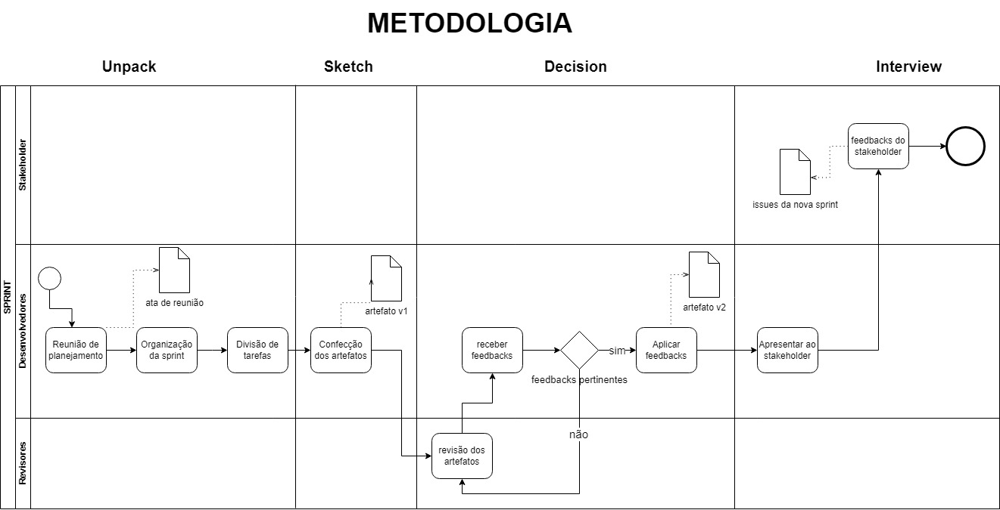

# 1.2. Módulo Processos/Metodologias/Abordagens

## Introdução

Esse artefato ilustra a metodologia de trabalho da Equipe 3 de 2024.1 da disciplina de Arquitetura e Desenho de Software da Universidade de Brasília. A equipe usou o Scrum como fundamento da metodologia de trabalho, sendo feitas adaptações para o contexto da disciplina. Como forma de ilustrar a metodologia, foi usado o diagrama BPMN.

## Metodologia

Para elaborar esse artefato, foi utilizado o material didádico elaborado pela professora Milene Serrano, tanto para a compreensão da metodologia Scrum, como para a elaboração do diagrama BPMN. O diagrama foi construído na plataforma draw.io.

## Scrum

O Scrum é uma metodologia do tipo ágil desenvolvida para projetos de desenvolvimento de software. Nessa metodologia, o projeto é dividido em ciclos de desenvolvimento e entrega chamado sprints. As sprints são períodos de tempo em que um conjunto de tarefas devem ser cumpridas. No início da sprint é feita uma reunião de planejamento para decidir o conjunto de atividades a serem feitas. Originalmente, o Scrum apresenta reuiniões diárias para discutir o progresso das atividades da sprint, porém no contexto da disciplina, não será atendido esse fator, ocorrendo apenas reuniões de planejamento e reuniões para caso ocorram circunstâncias excepcionais no projeto. Ao final da sprint serão apresentadas as atividades feitas e os artefatos produzidos. Após receber o feedback da apresentação, inicia-se o planejamento da próxima sprint, levando em conta alterações propostas no feedback.

## BPMN

O BPMN (Business Process Management Notation), como o nome diz, é uma notação de gerenciamento de processos de negócio. Para esse artefato, o BPMN foi usado para o mapeamento de processo de trabalho da equipe. O diagrama é destinado a stakeholders e desenvolvedores em um processo de negócio para aumentar sua compreensão por meio de uma representação visual prática das etapas.

Figura 1: BPMN metodologia de trabalho

## Bibliografia

[1] SERRANO. Milene, Arquitetura e Desenho de Software
AULA – Notação BPMN. Disponível em: https://aprender3.unb.br/pluginfile.php/2790232/mod_label/intro/Arquitetura%20e%20Desenho%20de%20software%20-%20Aula%20BPMN%20Exemplos%20-%20Profa.%20Milene.pdf

[2] Lucidchart, O que é BPMN?. Disponível em: https://www.lucidchart.com/pages/pt/o-que-e-bpmn

[3] DesenvolvimentoÁgil, SCRUM. Disponível em: https://www.desenvolvimentoagil.com.br/scrum/

## Histórico de Versão

| Versão | Data | Descrição| Autor(es) | Revisor(es)
|--|--|--|--|--|
|`1.0` | 06/04/2024 | - Criação do documento - Formulação do Diagrama |Leonardo Machado  João Nóbrega | João Nóbrega |
