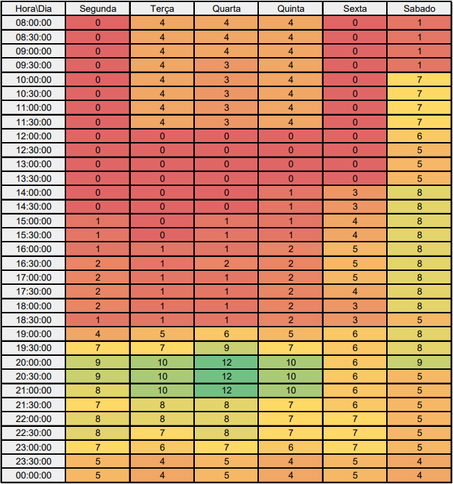

# <a>*Heat Map*</a>

## <a>*Introdução*</a>

Este HeatMap visa facilitar o agendamento de reuniões do grupo, ilustrando a disponibilidade dos integrantes em diferentes horários e dias da semana.

## <a>*Metodologia*</a>

1. **Coleta de dados:** Cada membro forneceu sua disponibilidade horária, incluindo dias e horários livres e indisponíveis.
2. **Consolidação das informações:** As informações individuais foram compiladas em uma única tabela, mapeando a disponibilidade de cada membro.
3. **Criação do HeatMap:** A ferramenta Hotjar foi utilizada para gerar o HeatMap, onde cores mais quentes indicam maior disponibilidade do grupo e cores mais frias indicam menor disponibilidade.

## <a>*Interpretação do HeatMap*</a>

* **Eixo X:** Dias da semana (segunda a sexta-feira).
* **Eixo Y:** Faixas horárias (manhã, tarde e noite).
* **Cores:**
    * Verde: Alta disponibilidade (maioria dos membros disponíveis).
    * Amarelo: Média disponibilidade (alguns membros disponíveis).
    * Laranja: Baixa disponibilidade (poucos membros disponíveis).
    * Vermelho: Indisponibilidade (nenhum membro disponível).

## <a>*Mapa de Calor*</a>

 
Figura 1: Mapa de calor

## <a>*Recomendações*</a>

* **Priorizar horários com maior disponibilidade:** Agendar reuniões nos horários com maior concentração de verde no HeatMap.
* **Considerar a disponibilidade individual:** Consultar a tabela com as informações individuais para verificar a disponibilidade de membros específicos em horários com menor disponibilidade do grupo.
* **Comunicar-se com antecedência:** Informar o grupo sobre a data e hora da reunião com antecedência para que os membros possam se organizar.

## <a>*Observações*</a>

* Este HeatMap é uma ferramenta que facilita o agendamento de reuniões, mas a decisão final sobre o horário da reunião deve levar em consideração outros fatores, como a urgência da reunião e a necessidade de participação de todos os membros.
* A disponibilidade dos membros pode sofrer alterações ao longo do tempo, portanto, é importante consultar o HeatMap e a tabela com as informações individuais antes de agendar cada reunião.

## <a>*Exemplo de Aplicação*</a>

Ao analisar o HeatMap, observa-se que a maior disponibilidade do grupo ocorre nas terças e quartas-feiras pela manhã e no final da tarde. O horário de menor disponibilidade é na sexta-feira à tarde.

## <a>*Próximos Passos*</a>

O HeatMap será atualizado periodicamente para refletir as mudanças na disponibilidade dos membros. O grupo também está avaliando a utilização de outras ferramentas para facilitar o agendamento de reuniões, como plataformas online de votação.

## <a>*Histórico de Versão*</a>

| Versão |    Data    |      Descrição      |                      Autor                       | Revisor |
| :----: | :--------: | :-----------------: | :----------------------------------------------: | :-----: |
|  1.0   | 07/04/2024 | Criação do Artefato | [João Lucas](https://github.com/VasconcelosJoao) |     |