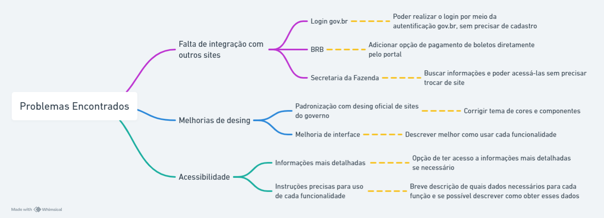

# <a>*Mapa Mental: Uma Ferramenta Essencial para Organizar Pensamentos e Ideias*</a>

## <a>*Introdução*</a>

O mapa mental é uma ferramenta para organizar pensamentos, ideias e informações de forma visual e hierárquica. Através de um diagrama com cores, imagens e palavras-chave, o mapa mental permite estruturar o conhecimento de maneira eficiente, facilitando a compreensão e a memorização. A metodologia também foi definida, por Tony Buzan, como um meio de utilizar a capacidade de associação do cérebro para maximizar o aprendizado e a criatividade.

## <a>*Metodologia*</a>

1. **Defina o tema central:** Determine o assunto principal que o mapa mental irá abordar.
2. **Brainstorming:** Faça uma lista de ideias, tópicos e subtópicos relacionados ao tema central.
3. **Organização:** Estruture as ideias em um diagrama hierárquico, utilizando cores, imagens e palavras-chave para facilitar a visualização.
4. **Revisão e Refinamento:** Revise o mapa mental para garantir a clareza, a lógica e a coerência das informações. Coffield destaca a importância de revisitar e ajustar continuamente os mapas mentais para refletir melhor a compreensão e novas informações.

Já aplicado ao nosso projeto, devido aos beneficios do mapa mental apresentado abaixo, decidimos realizar esse artefato

## <a>*Benefícios do Mapa Mental*</a>

* **Organização e clareza:** O mapa mental permite organizar e estruturar o conhecimento de forma visual e hierárquica, facilitando a compreensão e a memorização.
* **Estimulação da criatividade:** A natureza visual do mapa mental estimula a criatividade e a geração de novas ideias.
* **Melhor assimilação de informações:** A organização e a visualização das informações facilitam a assimilação e a retenção do conhecimento. Jensen argumenta que métodos visuais, como mapas mentais, são eficazes para a aprendizagem porque envolvem mais sentidos, o que melhora a retenção.
* **Resolução de problemas:** O mapa mental pode ser utilizado para analisar problemas, identificar causas e soluções de forma eficiente.

## <a>*Ferramentas para Criar Mapas Mentais*</a>

* **Software:** Existem diversos softwares para criação de mapas mentais, como MindMeister, Coggle e XMind.
* **Aplicativos:** Há diversos aplicativos para smartphones e tablets que permitem a criação de mapas mentais, como MindNode, Mindly e Popplet.
* **Papel e caneta:** O método tradicional de criação de mapas mentais com papel e caneta ainda é uma opção válida e eficaz.

## <a>*Exemplos de Aplicação*</a>

* **Planejamento de projetos:** O mapa mental pode ser utilizado para planejar projetos, definir objetivos, etapas e prazos.
* **Tomada de decisões:** O mapa mental pode ser utilizado para analisar diferentes opções e tomar decisões de forma mais consciente.
* **Estudos:** O mapa mental pode ser utilizado para organizar conteúdo de estudo, revisar para provas e apresentações.
* **Brainstorming:** O mapa mental é uma ferramenta ideal para brainstorming, geração de novas ideias e soluções criativas.

## <a>*Aplicação no Projeto*</a>

Para a aplicação prática no projeto, utilizamos diversas ferramentas colaborativas. Durante o desenvolvimento do mapa mental, fizemos uso do Discord para realizar chamadas de voz, permitindo discussões em tempo real. Utilizamos o Live Share do Visual Studio Code para colaborar na elaboração do artefato de forma síncrona, facilitando a edição e a revisão do mapa mental. A ferramenta Whimsical foi escolhida para a criação do mapa mental devido à sua interface intuitiva e funcionalidades robustas para diagramas.

## <a>*Mapa Mental Criado*</a>

Figura 1: Mapa Mental do projeto.

## <a>*Conclusão*</a>

O mapa mental é uma ferramenta poderosa e versátil que pode ser utilizada para diversos fins. Através da organização e visualização de informações, o mapa mental facilita a compreensão, a memorização e a geração de novas ideias.

## <a>*Bibliografia*</a>

    Buzan, Tony. The Mind Map Book: How to Use Radiant Thinking to Solve Problems, Create New Ideas and Master Information. Penguin Books, 2006.

    Coffield, Frank, et al. Learning Styles and Pedagogy in Post-16 Learning: A Systematic and Critical Review. Learning and Skills Research Centre, 2004.

    Jensen, Eric. Teaching with the Brain in Mind. ASCD, 2005.

## <a>*Histórico de Versão*</a>

| Versão |    Data    |      Descrição      |                      Autor                       |               Revisor               |
| :----: | :--------: | :-----------------: | :----------------------------------------------: | :---------------------------------: |
| `1.0`  | 07/04/2024 | Criação do Artefato | [João Lucas](https://github.com/VasconcelosJoao) |   [Papa](../../Subgrupos/Papa.md)   |
| `1.1`  | 07/04/2024 |   Complementação    |      [Foxtrot](../../Subgrupos/Foxtrot.md)       | [Yankee](../../Subgrupos/Yankee.md) |
| `2.0`  | 24/07/2024 | Ajustes conforme feedback  |      [Foxtrot](../../Subgrupos/Foxtrot.md)       | [Yankee](../../Subgrupos/Yankee.md) |

   