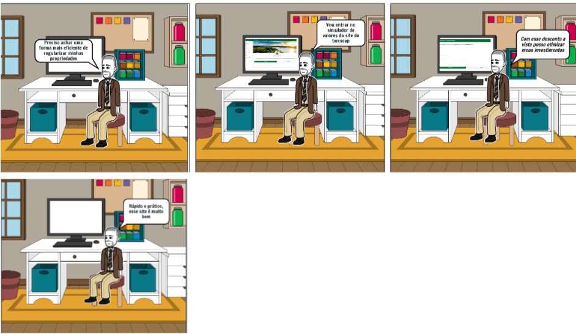

# <a>Storyboards</a>

## <a>Introdução</a>

Os storyboards são um exemplo de protótipos de baixa fidelidade, muito úteis devido sua simplicidade, baixo custo e rápida produção. Isso significa que podem ser rapidamente alterados. São geralmente utilizados em conjunto com cenários.  Ao empregar storyboards em conjunto com cenários ou roteiros, é possível visualizar e planejar a sequência de eventos, a composição das cenas, a posição dos personagens, a movimentação da câmera e outros elementos visuais cruciais. Isso ajuda a identificar possíveis problemas narrativos, ajustar a dinâmica da história e prever como ela será apresentada ao público.

O storyboard consiste em uma série de ilustrações sequenciais que representam os principais momentos, ações e composições visuais de uma cena ou de todo o enredo. Cada quadro do storyboard retrata uma cena específica, acompanhada por uma descrição escrita ou diálogos relacionados.

## <a>Tarefa 1 - Simulador De Valores</a>
Nessa primeira tarefa, o usuário utiliza o simulador de valores para calcular as parcelas do financiamento de um imóvel

## <a>Tarefa 2 - Investimentos</a>
Nessa tarefa, o usuario utiliza o site da terracap para encontrar informações de investimento, e encontra informações de um leilão de imóveis

## <a>Tarefa 3 - Regularizar Imóvel</a>
O usuário utiliza o site para regularizar um imóvel, encontrando informações de como realizar essa ação no site

## <a>*Bibliografia*</a>

    BARBOSA, Simone; DINIZ, Bruno. Interação Humano-Computador. Editora Elsevier, Rio de Janeiro, 2010.

## <a>*Histórico de Versão*</a>

| Versão |    Data    |       Descrição        |               Autor(es)               |             Revisor(es)             |
| :----: | :--------: | :--------------------: | :-----------------------------------: | :---------------------------------: |
| `1.0`  | 06/04/2024 |  Criação do documento  | [Foxtrot](../../Subgrupos/Foxtrot.md) | [Yankee](../../Subgrupos/Yankee.md) |
| `1.1`  | 07/04/2024 | Adição dos storyboards | [Foxtrot](../../Subgrupos/Foxtrot.md) |   [Papa](../../Subgrupos/Papa.md)   |

