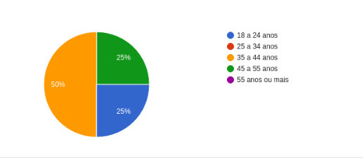
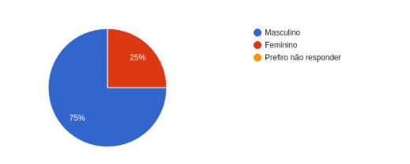
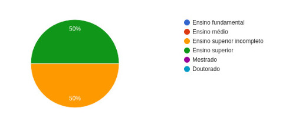
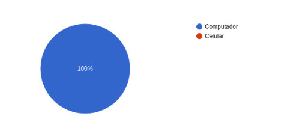
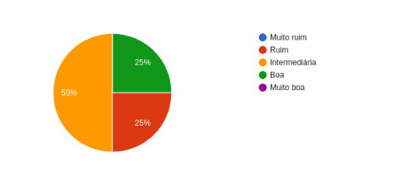
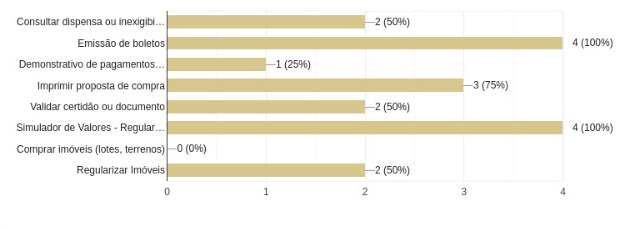
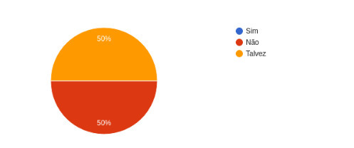
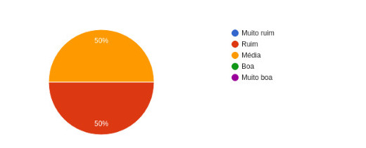

# <a> *Questionário* </a>

## <a> *Introdução* </a>

&emsp;&emsp;Este artefato tem por objetivo demonstrar a aplicação da técnica de elicitação escolhida de questionário, passando pelas perguntas escolhidas, detalhes de uso e resultados obtidos. 

## <a> *Metodologia* </a>

&emsp;&emsp;A técnica de elicitação por questionário é uma abordagem estruturada para coletar informações de um grupo de pessoas por meio de perguntas pré-definidas, o que a torna  uma ferramenta valiosa para pesquisa e coleta de informações em uma variedade de contextos.e utilizamos principalmente por conta da Eficiência na Coleta de Dados,Facilidade de Distribuição,Custo-Benefício e a Facilidade de Análise.

## <a>*Aplicação da técnica* </a>

&emsp;&emsp;Durante a utilização da técnica de elicitação questionários disponibilizamos um forms com as perguntas abaixo, com o objetivo de extrair as informações do usuários do site da terracap, abaixo de cada pergunta já se encontra seu respectivo resultado:

### <a>*Perguntas* </a>

<b> Qual sua idade? </b>

&emsp;&emsp;25% dos participantes têm entre 18 a 24, 50% têm entre 35 a 44 anos, enquanto 33% se encontra na faixa etária entre 45 a 55 anos de idade.

<b> Qual seu sexo? </b>

&emsp;&emsp;75% dos participantes declararam serem do sexo masculino enquanto 25% declararam serem do sexo feminino.

<b>Qual seu grau de escolaridade?</b>

&emsp;&emsp;50% dos participantes tem ensino superior completo e 50% possuem ensino superior incompleto.

<b> Em qual região do DF você mora? </b>

&emsp;&emsp;Resposta aberta levada em conta na análise, a grande maioria dos usuários declaram que se encontram na região de Arniqueiras e Santa Maria.

<b> Por onde você mais utiliza o site da Terracap? </b>

&emsp;&emsp;100% dos participantes da pesquisa utilizam mais o site pelo computador.

<b> Qual sua experiência ao utilizar o site da Terracap? </b>

&emsp;&emsp;50% dos participantes declaram terem uma experiência intermediária ao utilizarem o site da terracap enquanto, 25% relataram uma experiência boa e os outros 25% declararam uma experiência ruim.

<b> Qual(is) funcionalidade(s) do site você já utilizou?</b>

<b> Você acha que o design do site facilita encontrar as funcionalidades disponíveis? </b>

&emsp;&emsp;50% dos participantes relataram que não acham que o design do site facilita o encontro de funcionalidades, enquanto os outros 50% disseram que talvez.

<b> Existe alguma funcionalidade que você gostaria a mais no site? </b>

&emsp;&emsp;Pergunta aberta levada em consideração para a análise dos resultados, porém a grande maioria dos participantes relataram não conseguir pensar em mais uma funcionalidade.

<b>Como você julga a eficácia do suporte e das informações disponíveis no site</b>

&emsp;&emsp;50% dos participantes relataram que acham ruim a eficácia de suporte e das informações disponíveis no site, enquanto 50% relataram que acham  essa eficácia média.

<b>Existem integrações com outros sistemas ou entidades governamentais que você gostaria que este site suportasse?</b>

&emsp;&emsp;Resposta aberta levada em consideração na análise de resultados, porém a maioria dos participantes relataram que gostariam de algum tipo de integração com sistemas bancários.

<b>Alguma outra necessidade ou consideração importante que você gostaria de mencionar em relação ao site?</b>

&emsp;&emsp; Resposta aberta levada em consideração na análise de resultados. A maioria dos participantes disse que não tem nada a acrescentar.

## <a>*Histórico de Versão*</a>

| Versão | Data       | Descrição            | Autor(es)                       | Revisor(es)                           |
| ------ | ---------- | -------------------- | ------------------------------- | ------------------------------------- |
| `1.0`  | 06/04/2024 | Criação do documento | [Papa](../../Subgrupos/Papa.md) | [Foxtrot](../../Subgrupos/Foxtrot.md) |
| `1.1`  | 06/04/2024 | Correções de Padrão | [João Lucas](https://github.com/VasconcelosJoao) | [Papa](../../Subgrupos/Papa.md) |

