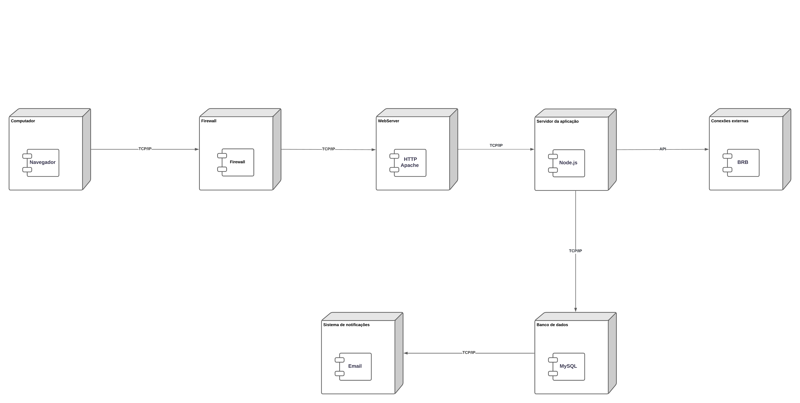

# <a> *Digrama de implantação* </a>

## <a> *Introdução* </a>

&emsp;&emsp;Um diagrama de implantação é uma representação visual que descreve a configuração física de um sistema de software, incluindo hardware e software, e as interações entre seus componentes. Ele oferece uma visão detalhada das diferentes partes do sistema e como elas estão distribuídas em uma infraestrutura física, como servidores, dispositivos de rede e outros recursos. A importância desse tipo de diagrama reside na sua capacidade de fornecer uma compreensão clara e concisa da arquitetura de implantação de um sistema, permitindo que os desenvolvedores, arquitetos e administradores de sistemas compreendam melhor como os componentes do sistema estão interconectados e como eles funcionam em conjunto para fornecer funcionalidades específicas. Além disso, o diagrama de implantação também pode ser uma ferramenta valiosa para planejar e otimizar a infraestrutura de um sistema, identificar possíveis pontos de falha e melhorar a escalabilidade e a eficiência do sistema como um todo.e no caso do nosso projeto o diagrama de implantação realizado foi baseado no sistema do terracap e abaixo é possível visualizar o diagrama completo

## <a> *Diagrama* </a>

## <a> *Notação do Diagrama de implantação* </a>

### <a> *Computador* </a> 

O usuário, por meio de um computador com acesso a internet acessa um navegador para entrar no site.

### <a> *Firewall* </a>

Monitora e controla o tráfego de entrada e de saída a fim de garantir a segurança e integridade do sistema.

### <a> *WebServer* </a>

 Atende às solicitações dos usuários através de uma interface web.

### <a> *Servidor da aplicação* </a>

 Executa a lógica de negócios do sistema e manipula operações sobre os dados.

### <a> *Banco de dados* </a> 

Usado para  armazenar e gerenciar dados como também assegurar sua segurança e integridade.

### <a> *Sistema de notificações* </a> 

Enviará notificações aos usuários por email sobre o status de suas solicitações.

### <a> *Conexões externas* </a> 

Realizar, por meio de APIs, a conexão com outros sistemas conforme a necessidade identificada na etapa anterior do projeto.

### <a> *Conexões entre os componentes* </a> 

&emsp;&emsp;A conexão entre os componentes do diagrama em sua maioria se dá através do protocolo TCP/IP, que de maneira geral é o padrão dominante para comunicações em redes de dados. 
Quando usuários acessam o sistema através de uma interface web, o servidor web e o servidor da aplicação comunicam-se utilizando TCP/IP para trocar dados e comandos.
Conexões de Banco de Dados: O servidor de aplicações se comunica com servidores de banco de dados usando TCP/IP, garantindo que as transações de dados sejam realizadas de maneira segura e eficiente. 
A conexão entre o banco de dados e o sistema de notificações seria por meio também do protocolo TCP/IP permitindo que esse sistema acesse informações atualizadas de forma confiável e segura para executar suas funções de notificação corretamente.

## <a> *Conclusão* </a>

&emsp;&emsp;O diagrama de implantação apresentado revela uma arquitetura de sistema robusta e bem estruturada, composta por hardware e software interligados de forma eficiente. A análise do diagrama permite observar que a infraestrutura em camadas garante modularidade, facilitando manutenções e expansões futuras. A segurança da rede é protegida por firewalls, enquanto a comunicação entre os componentes se dá através do protocolo TCP/IP, um padrão confiável e eficiente. As comunicações direcionadas e seguras minimizam o risco de perda ou interceptação de dados. Em suma, o diagrama demonstra um sistema bem estruturado, com foco na segurança e eficiência. A documentação completa, incluindo detalhes sobre dimensionamento, redundância e monitoramento, é crucial para uma avaliação completa da sua capacidade de atender às demandas do negócio.

## <a>*Referências Bibliográficas*</a>

1. Creately. Tutorial do diagrama de implantação. Disponível em: https://creately.com/blog/pt/diagrama/tutorial-do-diagrama-de-implantacao. Acesso em: 06 de maio de 2024.

2. Lucidchart. O que é diagrama de implementação UML. Disponível em: https://www.lucidchart.com/pages/pt/o-que-e-diagrama-de-implementacao-uml. Acesso em: 06 de maio de 2024.

3. IBM. Topologias de diagramas de implantação. Disponível em: https://www.ibm.com/docs/pt-br/rsas/7.5.0?topic=topologies-deployment-diagrams. Acesso em: 06 de maio de 2024.

## <a>*Histórico de Versão*</a>

| Versão | Data       | Descrição            | Autor(es)                    | Revisor(es)                        |
| ------ | ---------- | -------------------- | ---------------------------- | ---------------------------------- |
| `1.0`  | 10/05/2024 | Criação do documento | [Papa](../../Subgrupos/Papa.md) | |
| `1.1`  | 10/05/2024 | Correções de Padrão e adição do diagrama| [Papa](../../Subgrupos/Papa.md) | |