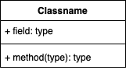
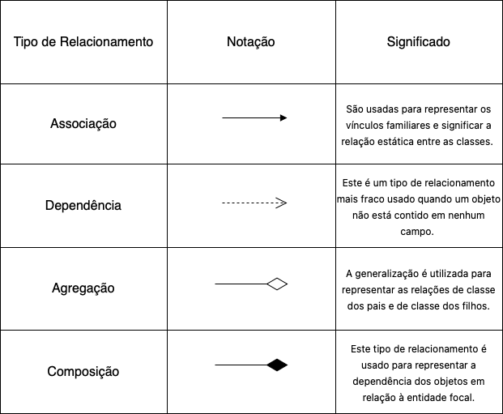

# <a> *Digrama de Classes* </a>

## <a> *Introdução* </a>

Um diagrama de classes é uma representação visual das estruturas e interações de um sistema de software orientado a objetos. Ele é uma ferramenta fundamental na modelagem de sistemas complexos, permitindo aos desenvolvedores entender a arquitetura do software de uma forma clara e concisa. Segundo Guedes (2008)<a id="REF1" href="#anchor_1">^1^</a>, é um dos elementos mais importantes utilizados na linguagem UML.

## <a> *Metodologia* </a>

O desenvolvimento do nosso Diagrama de Classes teve início com uma reunião realizada via plataforma Discord, na qual realizamos uma análise detalhada das tarefas a serem executadas. Durante essa discussão, estabelecemos um escopo claro para o projeto, priorizando os aspectos relacionados ao fluxo de cadastro no sistema e login, bem como a solicitação de Declaração de Retrovenda, a pesquisa por uma Região Administrativa e por setor, e a seleção de um imóvel. Após a reunião inicial realizada por meio da plataforma Discord, nossa equipe procedeu à conexão com o ambiente de modelagem [Draw.io](https://app.diagrams.net) para iniciar o desenvolvimento do Diagrama de Classes. Conforme recebermos o feedback da entrega faremos modificações no diagrama.

## <a> *Notações do Diagrama de Classes* </a>

### <a> *Classe* </a>

Classes constituem elementos essenciais na representação de entidades em sistemas. Visualmente, são retratadas como retângulos subdivididos em três seções distintas: o nome da classe no topo, seguido pelos atributos no meio (definindo as características dos objetos), e as operações na parte inferior (indicando as ações que os objetos podem executar). A Figura 1 ilustra a notação padrão empregada para representar classes.

Figura 1 - Notação de Classe 

    

Fonte: <a href="[Yankee](../../Subgrupos/Yankee.md">Yankee</a>, 2024

### <a> *Relacionamento* </a>
As classes estão interconectadas de maneiras específicas em diagramas de classes. Essas interligações incluem diversos tipos de relacionamentos, conforme detalhado na Tabela 1.

Figura 2 - Notação de Relacionamento 

    

Fonte: <a href="https://www.edrawsoft.com/pt/article/class-diagram-relationships.html">Edrawsoft<a id="REF3" href="#anchor_3">^3^</a></a>, 2024

## <a> *Diagrama de Classes* </a>

### <a> *Versão 1.0* </a>

    

## <a> *Conclusão* </a>

O diagrama de classes ofereceu ao grupo uma visão mais clara e concisa da estrutura das entidades e de suas interações no sistema. Essa abordagem nos permitiu uma compreensão mais aprofundada das regras de negócio, facilitando a transformação de ideias em classes, relacionamentos, atributos e métodos, além de uma descrição precisa dos padrões de projeto aplicados no desenvolvimento do sistema.

## <a>*Referências Bibliográficas*</a>

> <a id="anchor_1" href="#REF1">^1^</a> GILLEANES T A GUEDES. UML : uma abordagem prática. São Paulo: Novatec, 2008.

> <a id="anchor_2" href="#REF2">^2^</a> KIRILL FAKHROUTDINOV. UML Class Diagrams - Graphical Notation Reference. Disponível em: https://www.uml-diagrams.org/class-reference.html.

> <a id="ancho_3" href="#REF3">^3^</a> Relacionamentos em Diagramas de Classe UML. Disponível em: https://www.edrawsoft.com/pt/article/class-diagram-relationships.html.

## <a>*Histórico de Versão*</a>

| Versão | Data       | Descrição                                                          | Autor(es)                                        | Revisor(es)                           |
| ------ | ---------- | ------------------------------------------------------------------ | ------------------------------------------------ | ------------------------------------- |
| `1.0`  | 04/05/2024 | Criação do documento | [Yankee](../../Subgrupos/Yankee.md) | [Whiskey](../../Subgrupos/Whiskey.md) |
| `2.0`  | 08/07/2024 | Adição da Versão Atualizada | [Yankee](../../Subgrupos/Yankee.md) | [Whiskey](../../Subgrupos/Whiskey.md) |

