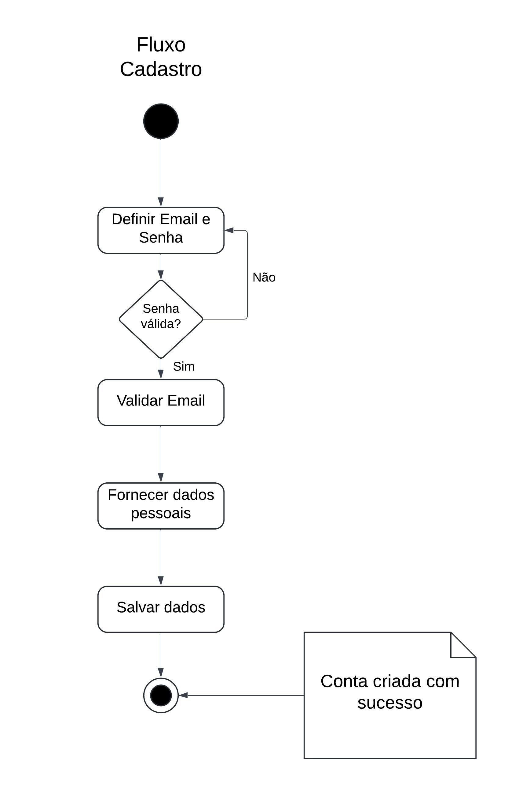
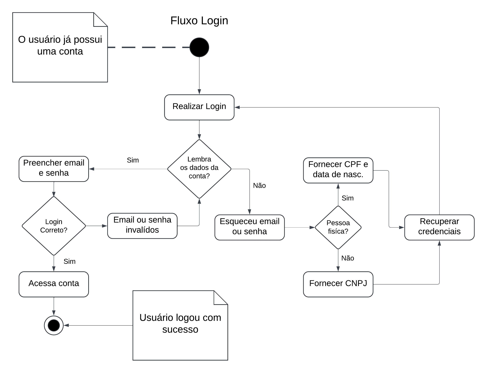
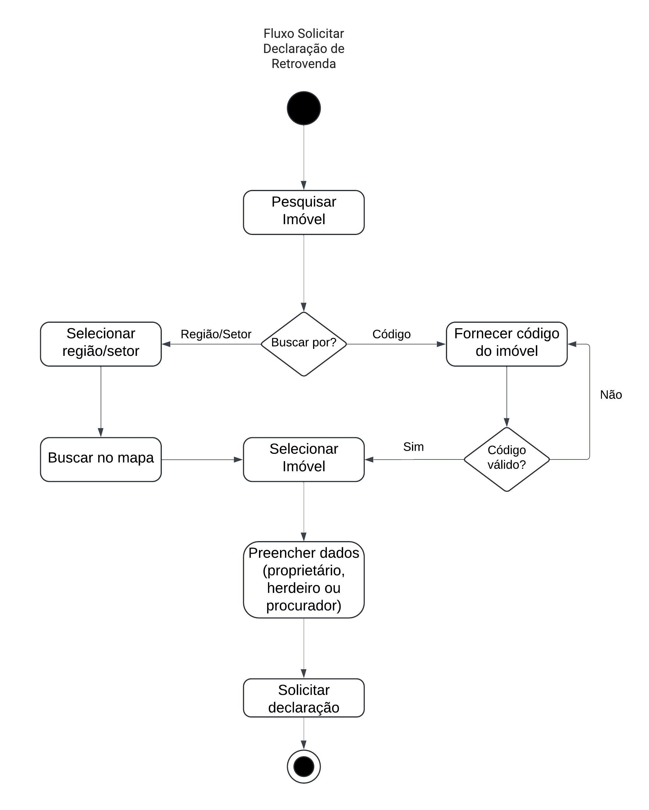

# <a>*Diagrama de Atividade*</a>

## <a>*Introdução*</a>

Esse artefato ilustra por meio de diagramas de atividade, os fluxos de interação do usuário baseados no site da Terracap. As atividades selecionadas para representação foram, cadastro, login, e solicitação de declaração de retrovenda.

## <a>*Metodologia*</a>

Para a elaboração desse artefato, foi utilizado o material didático em slides, e o material complementar disponibilizado pela professora Milene Serrano. Para a criação do diagrama, foi utilizada a ferramenta LucidChart.

## <a>*O que é um Diagrama de Atividade?*</a>

Um Diagrama de Atividade é uma representação gráfica que ilustra o fluxo de atividades em um sistema ou processo. Ele mostra como as operações são realizadas, em que sequência e sob quais condições. Este diagrama é útil para visualizar tanto o fluxo de controle (sequência de ações) quanto o fluxo de dados (movimentação de objetos) dentro do sistema.

## <a>*Principais Elementos de um Diagrama de Atividade*</a>

##### <a>*Atividades*</a>

Representam ações ou etapas individuais no processo. São normalmente desenhadas como retângulos arredondados.

##### <a>*Transições*</a>

Setas que mostram a sequência de atividades.

##### <a>*Decisões*</a>

Representadas por losangos, indicam pontos no fluxo onde uma escolha é feita.

##### <a>*Estados Iniciais e Finais*</a>

O estado inicial é indicado por um círculo sólido, e o estado final por um círculo com um círculo menor dentro.

##### <a>*Ramos e Junções*</a>

Mostram pontos onde o fluxo pode se dividir em várias direções ou convergir de várias direções em uma só.

##### <a>*Pools e Swimlanes*</a>

Utilizados para organizar atividades que pertencem a diferentes agentes ou partes do sistema.

## <a>*Fluxos*</a>

Nas imagens a seguir estão os fluxos identificados pelo subgrupo [Foxtrot](../../Subgrupos/Foxtrot.md)

### <a>*Cadastro*</a>

Figura 1 - Fluxo de Cadastro 1.0

Fonte: <a>[Foxtrot](../../Subgrupos/Foxtrot.md)</a>, 2024

### <a>*Login*</a>

Figura 2 - Fluxo de login 1.0

Fonte: <a>[Foxtrot](../../Subgrupos/Foxtrot.md)</a>, 2024

### <a>*Solicitar Declaração de Retrovenda*</a>

Figura 3 - Fluxo de declaração da retrovenda 1.0

</img>

Fonte: <a>[Foxtrot](../../Subgrupos/Foxtrot.md)</a>, 2024

## <a>*Conclusão*</a>

O diagrama de atividade é uma ferramenta valiosa que oferece diversas vantagens. Ele proporciona uma visão clara de como as atividades estão interligadas e a sequência em que ocorrem, ajudando a identificar e entender pontos de decisão no processo. Além disso, o diagrama de atividade serve como uma linguagem comum visual que facilita a comunicação entre membros da equipe, mesmo aqueles com diferentes níveis de entendimento técnico. Essa ferramenta também auxilia no planejamento do sistema, destacando como os processos interagem, o que é essencial para o design e implementação eficazes.

O diagrama de atividade é amplamente utilizado em diferentes contextos. No desenvolvimento de software, ele é usado para mapear a lógica de processos complexos ou casos de uso específicos. Na modelagem de processos de negócio, o diagrama de atividade é empregado para visualizar e melhorar os processos de negócios. Além disso, essa ferramenta contribui para criar uma documentação clara e compreensível dos fluxos de trabalho em sistemas.

## <a>*Bibliografia*</a>

    SERRANO. MILENE, AULA - MODELAGEM UML DIN MICA, 2024. Disponível em: https://aprender3.unb.br/pluginfile.php/2790248/mod_label/intro/Arquitetura%20e%20Desenho%20de%20Software%20-%20Aula%20Modelagem%20UML%20Din%C3%A2mica%20-%20Profa.%20Milene.pdf

    LUCIDCHART, UML Activity Diagram Tutorial. Disponível em: https://www.lucidchart.com/pages/uml-activity-diagram

## <a>*Histórico de Versão*</a>

| Versão |    Data    |                    Descrição                     |                    Autor(es)                     |                   Revisor(es)                    |
| :----: | :--------: | :----------------------------------------------: | :----------------------------------------------: | :----------------------------------------------: |
| `1.0`  | 03/06/2024 |               Criação do documento               |      [Whiskey](../../Subgrupos/Whiskey.md)       | [João Lucas](https://github.com/VasconcelosJoao) |
| `1.1`  | 01/07/2024 |           Adicionado diagrama de Login           |      [Whiskey](../../Subgrupos/Whiskey.md)       |       [Yankee](../../Subgrupos/Yankee.md)        |
| `1.2`  | 02/07/2024 |        Adicionado diagrama de Retrovenda         |      [Whiskey](../../Subgrupos/Whiskey.md)       |      [Foxtrot](../../Subgrupos/Foxtrot.md)       |
| `1.3`  | 04/07/2024 |          Correção das imagens e revisão          |      [Whiskey](../../Subgrupos/Whiskey.md)       |         [Papa](../../Subgrupos/Papa.md)          |
| `1.4`  | 05/07/2024 | Adição de Introdução, Metodologia e Bibliografia |      [Whiskey](../../Subgrupos/Whiskey.md)       |         [Papa](../../Subgrupos/Papa.md)          |
| `1.5`  | 09/07/2024 |        Revisão Final e correção de padrão        | [João Lucas](https://github.com/VasconcelosJoao) |      [Whiskey](../../Subgrupos/Whiskey.md)       |

