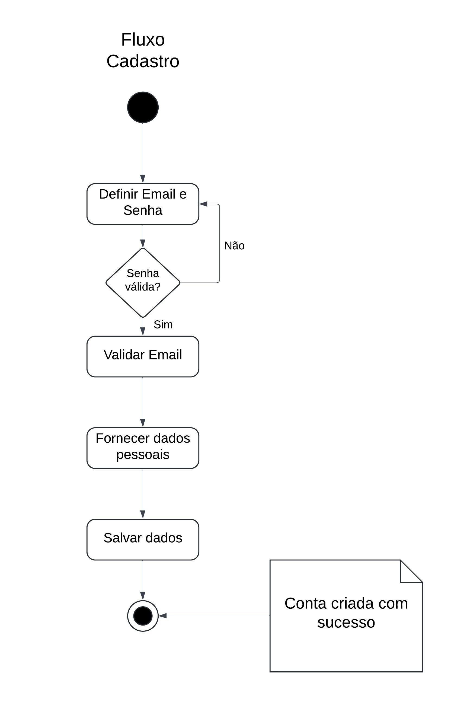
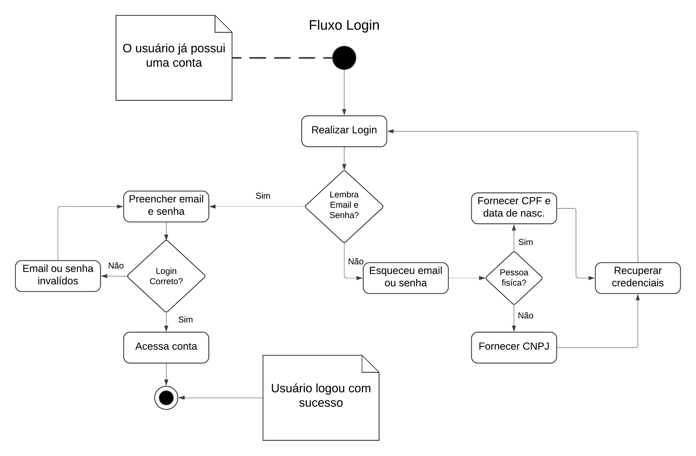
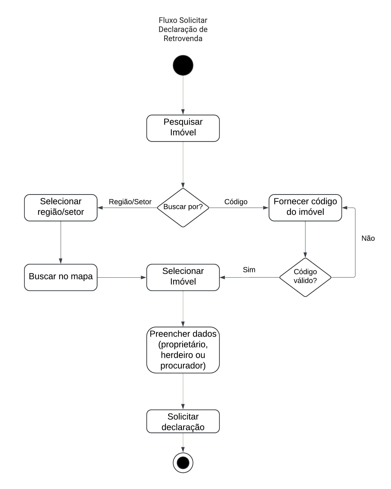

# Diagrama de Atividade

## Introdução

Esse artefato ilustra por meio de diagramas de atividade, os fluxos de interação do usuário baseados no site da Terracap. As atividades selecionadas para representação foram, cadastro, login, e solicitação de declaração de retrovenda.

## Metodologia

Para a elaboração desse artefato, foi utilizado o material didático em slides, e o material complementar disponibilizado pela professora Milene Serrano. Para a criação do diagrama, foi utilizada a ferramenta LucidChart.

## O que é um Diagrama de Atividade?

Um Diagrama de Atividade é uma representação gráfica que ilustra o fluxo de atividades em um sistema ou processo. Ele mostra como as operações são realizadas, em que sequência e sob quais condições. Este diagrama é útil para visualizar tanto o fluxo de controle (sequência de ações) quanto o fluxo de dados (movimentação de objetos) dentro do sistema.

## Principais Elementos de um Diagrama de Atividade

#####  1. Atividades

Representam ações ou etapas individuais no processo. São normalmente desenhadas como retângulos arredondados.

##### 2. Transições

Setas que mostram a sequência de atividades.

##### 3. Decisões

Representadas por losangos, indicam pontos no fluxo onde uma escolha é feita.

##### 4. Estados Iniciais e Finais

O estado inicial é indicado por um círculo sólido, e o estado final por um círculo com um círculo menor dentro.

##### 5. Ramos e Junções

Mostram pontos onde o fluxo pode se dividir em várias direções ou convergir de várias direções em uma só.

##### 6. Pools e Swimlanes

Utilizados para organizar atividades que pertencem a diferentes agentes ou partes do sistema.

# Fluxos

## Cadastro

## Login

## Solicitar Declaração de Retrovenda

## Vantagens do Diagrama de Atividade

- Fluxo de Controle: Proporciona uma visão clara de como as atividades estão interligadas e a sequência em que ocorrem.
- Identificação de Condições: Ajuda a identificar e entender pontos de decisão no processo.
- Comunicação: Serve como uma linguagem comum visual que facilita a comunicação entre membros da equipe, que podem ter diferentes níveis de entendimento técnico.
- Planejamento e Design: Auxilia no planejamento do sistema, destacando como os processos interagem, o que é essencial para o design e implementação eficazes.

## Quando Usar um Diagrama de Atividade?

- Desenvolvimento de Software: Para mapear a lógica de processos complexos ou casos de uso específicos.
- Modelagem de Processos de Negócio: Para visualizar e melhorar processos de negócios.
- Documentação de Sistemas: Para criar uma documentação clara e compreensível dos fluxos de trabalho.

## Bibliografia

[1] SERRANO. MILENE, AULA - MODELAGEM UML DINÂMICA, 2024. Disponível em: <https://aprender3.unb.br/pluginfile.php/2790248/mod_label/intro/Arquitetura%20e%20Desenho%20de%20Software%20-%20Aula%20Modelagem%20UML%20Din%C3%A2mica%20-%20Profa.%20Milene.pdf>

[2] LUCIDCHART, UML Activity Diagram Tutorial. Disponível em: <https://www.lucidchart.com/pages/uml-activity-diagram>

## <a>*Histórico de Versão*</a>

| Versão |    Data    |      Descrição       |                    Autor(es)                     |              Revisor(es)              |
| :----: | :--------: | :------------------: | :----------------------------------------------: | :-----------------------------------: |
| `1.0`  | 03/06/2024 | Criação do documento | [Vitor B.](https://github.com/VitorB2002) | |
| `1.1`  | 01/07/2024 | Adicionado diagrama de Login | [Vitor B.](https://github.com/VitorB2002) | [Joao Nobrega](https://github.com/bot-do-jao) |
| `1.2`  | 02/07/2024 | Adicionado diagrama de Retrovenda | [Vitor B.](https://github.com/VitorB2002) | [Joao Nobrega](https://github.com/bot-do-jao) |
| `1.3`  | 04/07/2024 | Correção das imagens e revisão | [Joao Nobrega](https://github.com/bot-do-jao) | |
| `1.4`  | 05/07/2024 | Adição de Introdução, Metodoligia e Bibliografia|  [Leonardo Machado](https://github.com/leonardogonmac)| | 

