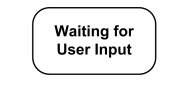
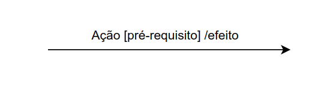
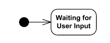
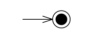
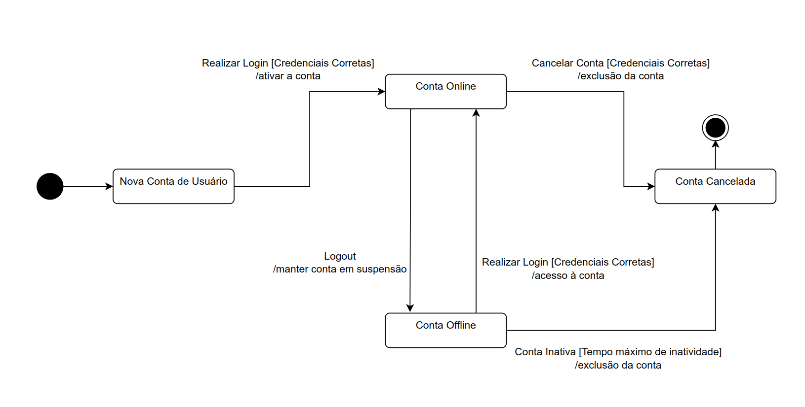
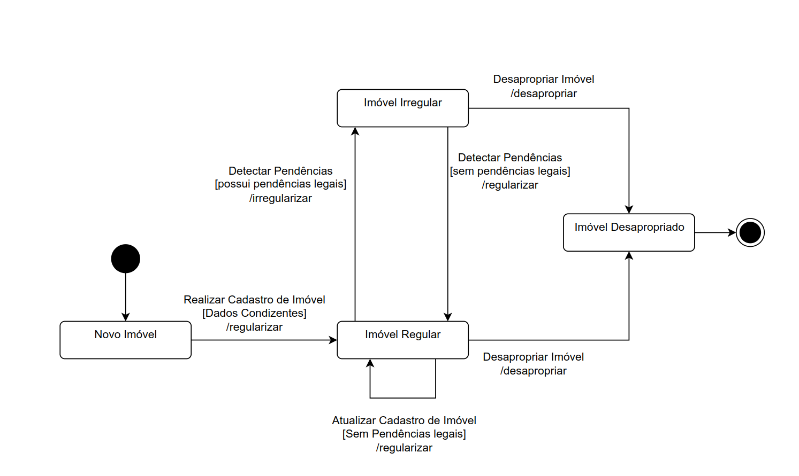

# <a>*Diagrama de Estados*</a>

## <a>*Introdução*</a>

Este artefato ilustra por meio de dois digramas de estados, as situações as quais os objetos que simbolizam uma conta de usuário e um imóvel podem estar no sistema. O sistema é inspirado no site da Terracap.

## <a>*Metodologia*</a>

 Os fundamentos teóricos para a elaboração do artefato foram obtidos consultando o material didático em slides disponibilizado pela professora Milene Serrano e o site uml-diagrams.org. Esses materiais são a referência para a seção que detalha do funcionamento do diagrama de estados. Para a construção dos diagramas foi utilizada a ferramenta DrawIo. Os objetos selecionados para o diagrama de estados foram escolhidos com base em sua relevância para grande parte das operações do sistema.

## <a>*Fundamentos do Diagrama de Estados*</a>

O diagrama de estados é um diagrama dinâmico que tem como objetivo ilustrar os diferentes estados em que um dado objeto pode se encontrar na execução do sistema. Por meio de ações,o objeto em questão possui seu estado alterado.  As ações podem ser desencadeadas pelo próprio sistema, ou por acontecimentos fora do sistema.

Os diagramas de estados elaborados apresentam os seguintes elementos:

**Estado Simples:** Representado por uma célula retangular com o nome do estado.

Figura 1: Estado Simples

Fonte: <a>[Whyskey](../../Subgrupos/Whiskey.md)</a>, 2024

**Transições:** Representadas por uma seta com a descrição da ação, do pré-requisito e do efeito.

Figura 2: Transição

Fonte: <a>[Whyskey](../../Subgrupos/Whiskey.md)</a>, 2024

**Pseudo-estado de início:** um círculo preto simbolizando o local de partida do diagrama.

Figura 3: Pseudo-estado de início

Fonte: <a>[Whyskey](../../Subgrupos/Whiskey.md)</a>, 2024

**Estado de fim:** Um círculo preto contido em uma circunferência mais externa, simbolizando o fim do diagrama.

Figura 4: Estado de fim

Fonte: <a>[Whyskey](../../Subgrupos/Whiskey.md)</a>, 2024

Os diagramas de estados podem possuir outros tipos de estados e pseudo-estados que não foram necessários para a elaboração dos diagramas propostos.

## <a>*Diagrama de Estado da Conta do Usuário*</a>

O diagrama abaixo representa os estados em que um objeto que representa a conta de um usuário pode se encontrar. Após a conta ser criada, é necessário realizar um primeiro login para ativar a conta e ir para o estado online pela primeira vez. Posteriormente, a conta transita entre os estados online e offline por meio das ações de Logout e Realizar Login. Por fim, a conta pode ser cancelada por meio do próprio usuário com a conta online, ou por meio do próprio sistema por inatividade prolongada. 

Figura 5: Diagrama de Estados da Conta do Usuário

Fonte: <a>[Whyskey](../../Subgrupos/Whiskey.md)</a>, 2024

## <a>*Diagrama de Estados do Imóvel*</a>

O diagrama abaixo representa os estados em que um objeto que representa um imóvel cadastrado pode se encontrar. Após o cadastro do imóvel, ele irá para o estado regular. Caso o sistema eventualmente detecte pendências legais envolvendo o imóvel, ele se irá para o estado irregular. Quando as pendências estiverem quitadas, ele retorna para o estado regular. Caso o imóvel seja desapropriado pelo governo, tanto no estado regular, como no irregular, ele irá para o estado de desapropriado.

Figura 6: Diagrama de Estados do Imóvel

Fonte: <a>[Whyskey](../../Subgrupos/Whiskey.md)</a>, 2024

## <a>*Bibliografia*</a>

    SERRANO. MILENE, AULA - MODELAGEM UML DINÂMICA, Universidade de Brasília, 2024, Disponível em: <https://aprender3.unb.br/pluginfile.php/2790248/mod_label/intro/Arquitetura%20e%20Desenho%20de%20Software%20-%20Aula%20Modelagem%20UML%20Din%C3%A2mica%20-%20Profa.%20Milene.pdf>

    FAKHROUTDINOV. KIRILL, State Machine Diagrams, uml-diagrams.org, 2009, Disponível em: https://www.uml-diagrams.org/state-machine-diagrams.html

## <a>*Histórico de Versão*</a>

| Versão |    Data    |             Descrição              |                    Autor(es)                     |                   Revisor(es)                    |
| :----: | :--------: | :--------------------------------: | :----------------------------------------------: | :----------------------------------------------: |
| `1.0`  | 07/06/2024 |        Criação do documento        |      [Whiskey](../../Subgrupos/Whiskey.md)       | [João Lucas](https://github.com/VasconcelosJoao) |
| `1.1`  | 07/06/2024 |         Adição das imagens         |      [Whiskey](../../Subgrupos/Whiskey.md)       |       [Yankee](../../Subgrupos/Yankee.md)        |
| `1.2`  | 07/07/2024 |        Revisão do artefato         |         [Papa](../../Subgrupos/Papa.md)          |      [Foxtrot](../../Subgrupos/Foxtrot.md)       |
| `1.5`  | 09/07/2024 | Revisão Final e correção de padrão | [João Lucas](https://github.com/VasconcelosJoao) |      [Whiskey](../../Subgrupos/Whiskey.md)       |

