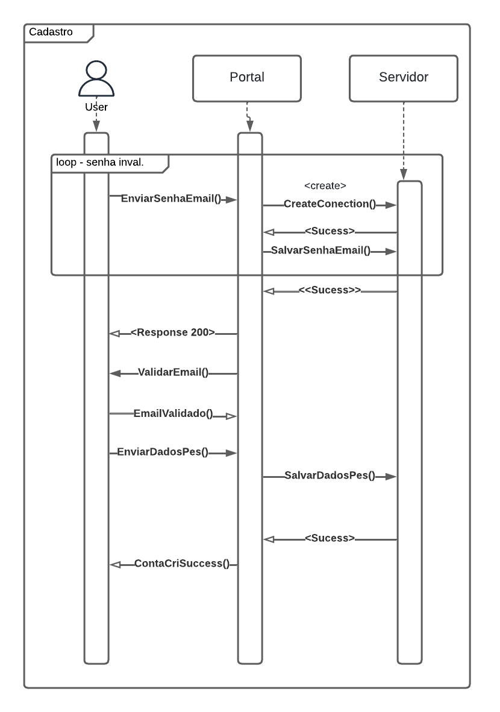
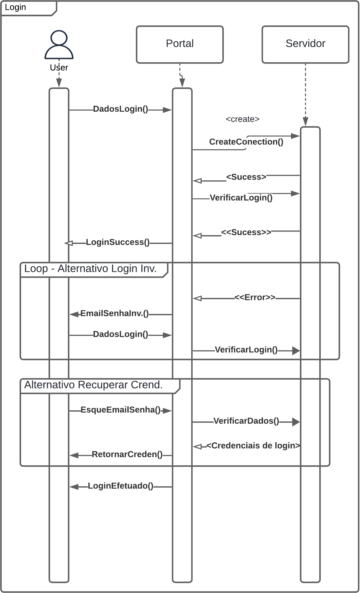
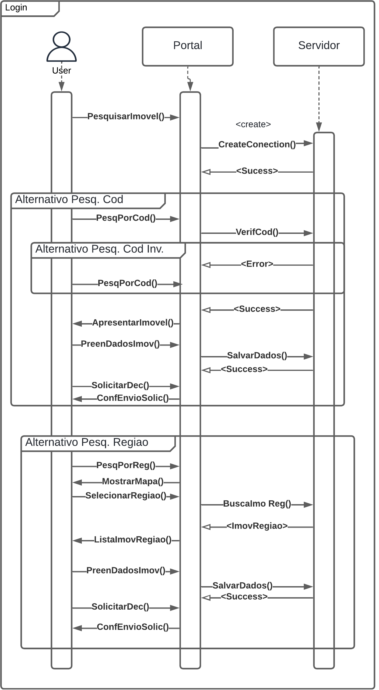

# <a>*Diagrama de Sequência*</a>

## <a>*Introdução*</a>

Esse artefato ilustra por meio de diagramas de sequência, as chamadas de processos e métodos em determinados funcionalidades baseadas no site da Terracap. As funcionalidades selecionadas para representação foram, cadastro, login, e solicitação de declaração de retrovenda.

## <a>*Metodologia*</a>

Para a elaboração desse artefato, foi utilizado o material didático em slides, e o material complementar disponibilizado pela professora Milene Serrano. Para a criação do diagrama, foi utilizada a ferramenta LucidChart.

## <a>*O que é um Diagrama de Sequência?*</a>

Um Diagrama de Sequência é uma representação gráfica que ilustra o fluxo de chamadas de processos/métodos em um sistema. Ele mostra o momento que as chamadas são realizadas e em que sequência.

## <a>*Principais Elementos de um Diagrama de Sequência*</a>

##### <a>*LifeLine*</a>

Rpresentados por retângulos grandes com a identificação de uma determinado objeto, logo abaixo do retângulo temos uma linha que representa o "tempo de vida" de determinada entidade durante o fluxo da atividade.

##### <a>*Execution specification*</a>

Representado por retângulos longos e finos, ilustram o tempo em que determinado método leva para leva para ser executado e retornar uma resposta.

##### <a>*Synchronous/asynchronous message*</a>

Representados por setas de pontas preenchidas/vazias, respectivamente. Identificam quando um método é acionado e quando é feito o retorno de uma resposta do método.

##### <a>*Interaction use*</a>

Representado por um retângulo branco com uma marcação na ponta. Representa alguma possível interação com o usuário, seja mostrar um dado ou um input.

##### <a>*Duration constraint*</a>

Representado por uma seta vertical com duas setas nas pontas. Identifica o tempo entre duas "Execution specification" diferentes.

##### <a>*Object creation message*</a>

Mesma representação de uma "Synchronous/asynchronous message", contudo com um texto em cima que vai descrever que um método contrutor de entidade está sendo chamado.

##### <a>*Destruction object*</a>

Representado por um "X", demarcar o final de uma "LifeLine" de determinada entidade, sendo encerrada e só poderá ser chamada novamente se algum método construtor da entidade for chamado antes. 

## <a>*Fluxos*</a>

Nas imagens a seguir estão os fluxos identificados pelo subgrupo [Foxtrot](../../Subgrupos/Foxtrot.md)

### <a>*Cadastro*</a>

Figura 1 - Fluxo de Cadastro 1.0

Fonte: <a>[Foxtrot](../../Subgrupos/Foxtrot.md)</a>, 2024

### <a>*Login*</a>

Figura 2 - Fluxo de login 1.0

Fonte: <a>[Foxtrot](../../Subgrupos/Foxtrot.md)</a>, 2024

### <a>*Solicitar Declaração de Retrovenda*</a>

Figura 3 - Fluxo de declaração da retrovenda 1.0

</img>

Fonte: <a>[Foxtrot](../../Subgrupos/Foxtrot.md)</a>, 2024

## <a>*Conclusão*</a>

O diagrama de sequência é uma ferramenta poderosa que oferece diversas vantagens. Ele proporciona uma visão clara do fluxo de processos de uma determinada atividade, permitindo a identificação de gargalos e dependências entre os processos. Essa compreensão do fluxo de controle é especialmente útil no desenvolvimento de software, na modelagem de processos de negócio e na documentação de sistemas.

O diagrama de sequência é amplamente utilizado em diferentes contextos. No desenvolvimento de software, ele ajuda a mapear a comunicação entre os diversos componentes do sistema, principalmente suas dependências e paralelismo. Na modelagem de processos de negócio, o diagrama de sequência estabelece um fluxo de prioridade e dependência com maior eficiência. Além disso, ele contribui para criar uma documentação clara e compreensível dos fluxos de trabalho em sistemas.

## <a>*Bibliografia*</a>

    SERRANO. MILENE, AULA - MODELAGEM UML DIN MICA, 2024. Disponível em: https://aprender3.unb.br/pluginfile.php/2790248/mod_label/intro/Arquitetura%20e%20Desenho%20de%20Software%20-%20Aula%20Modelagem%20UML%20Din%C3%A2mica%20-%20Profa.%20Milene.pdf

    LUCIDCHART, UML Activity Diagram Tutorial. Disponível em: https://www.lucidchart.com/pages/uml-activity-diagram

## <a>*Histórico de Versão*</a>

| Versão |    Data    |             Descrição              |                    Autor(es)                     |                   Revisor(es)                    |
| :----: | :--------: | :--------------------------------: | :----------------------------------------------: | :----------------------------------------------: |
| `1.0`  | 07/07/2024 |        Criação do documento        |      [Foxtrot](../../Subgrupos/Foxtrot.md)       | [João Lucas](https://github.com/VasconcelosJoao) |
| `1.1`  | 08/07/2024 |        Revisão do documento        |      [Whiskey](../../Subgrupos/Whiskey.md)       |         [Papa](../../Subgrupos/Papa.md)          |
| `1.2`  | 09/07/2024 | Revisão Final e correção de padrão | [João Lucas](https://github.com/VasconcelosJoao) |      [Yankee](../../Subgrupos/Yankee.md)       |

