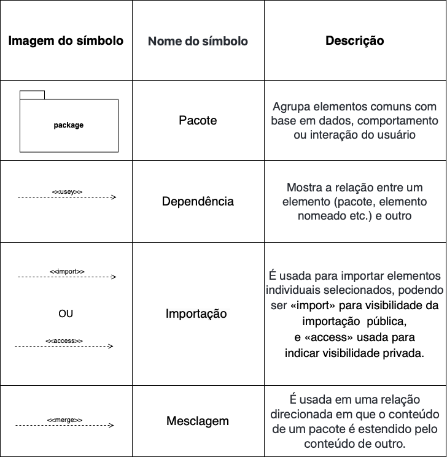
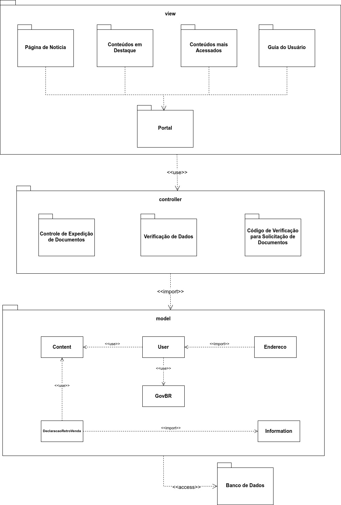

# <a> *Diagrama de Pacotes* </a>

## <a> *Introdução* </a>

O diagrama de pacotes é uma ferramenta essencial na linguagem de modelagem unificada (UML), utilizada para organizar e estruturar elementos semanticamente relacionados dentro de um sistema projetado no nível dos pacotes.
 É especialmente útil em [diagramas de classes](DiagramaDeClasses.md), onde as classes são organizadas dentro de pacotes, mas também pode ser aplicado a outros tipos de modelos UML para organizar elementos como classes, entidades de dados e casos de uso. A integração dos pacotes em diversos diagramas UML facilita a simplificação e a compreensão do modelo.

## <a> *Metodologia* </a>

Para elaboração do nosso Diagrama de Pacote tivemos como base nosso [Diagrama de Classes](DiagramaDeClasses.md) e por meio de uma reunião realizada via plataforma Discord, para a produção do diagrama inicialmente consideramos a adoção do padrão arquitetural Modelo-Visão-Controladora (MVC) como uma abordagem para melhor visualização e organização do sistema. Foi utilizado a ferramenta de construção [Draw.io](https://app.diagrams.net) e a linguagem foi a UML. Cada membro do subgrupo ficou participou nas seguintes etapas simultaneamente (via Discord):
> Criação da Documentação
>
> Elaboração e Discussão do Diagrama de Pacote (Via Discord)
>
Conforme o feedback da entrega faremos modificações no diagrama.

## <a> *Notações do Diagrama de Pacotes* </a>

### <a> *Pacote* </a>

O pacote é um *namespace* usado para agrupar elementos que estão semanticamente relacionados e podem mudar juntos.

### <a> *Elemento empacotável* </a>

O Elemento empacotável é um elemento nomeado, possivelmente de propriedade direta de um pacote. Pode incluir eventos, componentes, casos de uso e os próprios pacotes.

### <a> *Dependência* </a>

A dependência é uma relação entre elementos nomeados, que na UML inclui muitos elementos diferentes, por exemplo, classes, interfaces, componentes, artefatos, pacotes, etc.

### <a> *Importação de elemento* </a>

A importação de elementos é uma relação direcionada entre um namespace de importação e um elemento empacotável importado.

### <a> *Importação de pacote* </a>

A importação de pacotes é uma relação direcionada entre um namespace de importação e um pacote importado, que permite o uso de nomes não qualificados para se referir aos membros do pacote do(s) outro(s) namespace(s).

### <a> *Mesclagem de pacotes* </a>

Uma mesclagem de pacotes é uma relação direcionada entre dois pacotes que indica que o conteúdo de um pacote é estendido pelo conteúdo de outro pacote.

<a id="REF1" href="#anchor_1">A Figura 1</a> ilustra a notação padrão empregada para representar os componentes do diagrama.

Figura 1 - Componentes do diagrama de pacotes

    

Fonte: <a>[Yankee](../../Subgrupos/Yankee.md)</a>, 2024

## <a> *Diagrama de Pacote* </a>

### <a> *Versão 1.0* </a>

Na figura abaixo encontra-se o Diagrama confecionado inicialmente pelo subgrupo [Yankee](../../Subgrupos/Yankee.md):

Figura 2 - Diagrama de Pacotes 1.0

    

Fonte: <a>[Yankee](../../Subgrupos/Yankee.md)</a>, 2024

### <a> *Versão 2.0* </a>

Para a entrega final, o subgrupo [Yankee](../../Subgrupos/Yankee.md) analisou o feedback da professora sobre a primeira versão do diagrama e reuniu-se para alterá-lo visando a sua inclusão no documento de [Visão Lógica](../../ArquiteturaReutilizacao/EstilosPadroesArquiteturais/VisaoLogica.md).

Figura 3 - Diagrama de Pacotes 2.0

    
Fonte: <a>[Yankee](../../Subgrupos/Yankee.md)</a>, 2024

## <a> *Conclusão* </a>

Através da elaboração do Diagrama de Pacote, o grupo pôde visualizar e organizar de forma mais clara e estruturada os elementos do sistema projetado. A adoção do padrão arquitetural Modelo-Visão-Controladora (MVC) proporcionou uma melhor compreensão das relações entre os componentes. Além disso, a integração dos pacotes em outros diagramas UML facilitou a simplificação e a compreensão do modelo como um todo. Com base no feedback recebido, o grupo está preparado para fazer modificações no diagrama, aprimorando ainda mais a representação do sistema.

## <a>*Bibliografia*</a>

    UML DIAGRAMS. UML Package Diagrams Overview, 2023. Disponível em: https://www.uml-diagrams.org/package-diagrams-overview.html. Acesso em: 08/07/2024.

    Tudo sobre diagramas de pacotes UML. Disponível em:  https://www.lucidchart.com/pages/pt/diagrama-de-pacotes-uml#

## <a>*Histórico de Versão*</a>

| Versão |    Data    |             Descrição              |                    Autor(es)                     |              Revisor(es)              |
| :----: | :--------: | :--------------------------------: | :----------------------------------------------: | :-----------------------------------: |
| `1.0`  | 08/07/2024 |        Criação do documento        |       [Yankee](../../Subgrupos/Yankee.md)        | [Whiskey](../../Subgrupos/Whiskey.md) |
| `1.1`  | 08/07/2024 |         Adição do Diagrama         |       [Yankee](../../Subgrupos/Yankee.md)        |    [Papa](../../Subgrupos/Papa.md)    |
| `1.2`  | 09/07/2024 | Revisão Final e correção de padrão | [João Lucas](https://github.com/VasconcelosJoao) | [Foxtrot](../../Subgrupos/Foxtrot.md) |
| `1.3`  | 15/08/2024 |        Adição de versão 2.0        |       [Yankee](../../Subgrupos/Yankee.md)        | [Foxtrot](../../Subgrupos/Foxtrot.md) |

