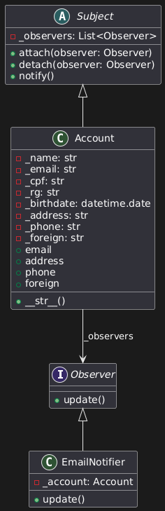

<!-- Foco_3: Padrões de Projeto GoFs Comportamentais.

Entrega Mínima: 1 Padrão GoF Comportamental, com nível de modelagem e nível de implementação evidenciados.
Apresentação (em sala) explicando o GoF Comportamental, com: (i) rastro claro aos membros participantes (MOSTRAR QUADRO DE PARTICIPAÇÕES & COMMITS); (ii) justificativas & senso crítico sobre o padrão GOF comportamental; (iii) breve apresentação do padrão GOF comportamental elaborado, e (iv) comentários gerais sobre o trabalho em equipe. Tempo da Apresentação: +/- 5min. Recomendação: Apresentar diretamente via Wiki ou GitPages do Projeto. Baixar os conteúdos com antecedência, evitando problemas de internet no momento de exposição nas Dinâmicas de Avaliação.

A Wiki ou GitPages do Projeto deve conter um tópico dedicado ao Módulo Padrões de Projeto GoFs Comportamentais, com 1 padrão GoF Comportamental (modelagem & implementação), histórico de versões, referências, e demais detalhamentos gerados pela equipe nesse escopo.

Demais orientações disponíveis nas Diretrizes (vide Moodle). -->
# <a>*GoFs Comportamentais*</a>

## <a>*Introdução*</a>

Artefato de especificação do GoF Comportamental de padrão Observer implementado pelo subgrupo [Whiskey](../../Subgrupos/Whiskey.md).

## <a>*Metodologia*</a>

O subgrupo [Whiskey](../../Subgrupos/Whiskey.md) se reuniu para discutir e viualizar os diversos padrões de projeto GoFs Comportamentais, com o objetivo de apresentar um padrão GoF Comportamental, com nível de modelagem e nível de implementação que possam ser utilizados na melhoria da plataforma da Terracap. Nesta reunião, após discutir e analisar os padrões, decidimos modelar e implementar os seguintes padrões:

* State
* Observer


## <a>*Padrão Observer*</a>

Decidimos modelar e implementar um sistema de notificações para o usuário, que será utilizado para notificar o mesmo quando informações da sua conta forem alteradas.

### <a>*Modelagem*</a>

<center> 


Figura 1 - Diagrama de classes do padrão Observer[2]
</center>

### <a>*Implementação*</a>

Para a implementação do padrão, foi utilizado a linguagem de programação Python.

```python
# Subject
class Subject(ABC):
    def __init__(self):
        self._observers = []

    def attach(self, observer):
        self._observers.append(observer)

    def detach(self, observer):
        self._observers.remove(observer)

    def notify(self):
        for observer in self._observers:
            observer.update()
```

* A classe Subject possui métodos para anexar (attach), desanexar (detach) e notificar (notify) observadores. Desta forma é possível criar uma lista de elementos que serão notificados quando a classe Subject for notificada.

```python
# Classe de conta de usuário
class Account(Subject):
    # Construtor, para criar uma conta de usuário é necessário informar seu nome, e-mail, CPF e data de nascimento
    def __init__(self, name, email, cpf, rg, birthdate):
        super().__init__()
        self._name = name
        self._email = email
        self._cpf = cpf
        self._rg = rg
        self._birthdate = birthdate
        self._address = None
        self._phone = None
        self._foreign = None

    # Getters e setters
    @property
    def email(self):
        return self._email

    @email.setter # Setter
    def email(self, value):
        self._email = value
        self.notify() # Notifica todos os observadores

    @property
    def address(self):
        return self._address

    @address.setter
    def address(self, value):
        self._address = value
        self.notify() # Notifica todos os observadores

    @property
    def phone(self):
        return self._phone

    @phone.setter
    def phone(self, value):
        self._phone = value
        self.notify() # Notifica todos os observadores

    @property
    def foreign(self):
        return self._foreign

    @foreign.setter
    def foreign(self, value):
        self._foreign = value
        self.notify() # Notifica todos os observadores

    def __str__(self):
        return f"({self._name}, {self._cpf})"
```

* A classe Account estende Subject e adiciona alguns atributos relativos aos dados do usuário na plataforma da Terracap.

* Quando o telefone, endereço ou 'foreign'(usuário estrangeiro) for alterado, a classe Account notifica todos os observadores.

```python
# Observer
class Observer(ABC):
    @abstractmethod
    def update(self):
        pass
```

* A classe Observer define uma interface com o método update que deve ser implementado por observadores concretos.

```python
# Notificador de e-mail
class EmailNotifier(Observer):
    def __init__(self, account):
        self._account = account
        self._account.attach(self)

    # Método de atualização
    def update(self):
        print(f"Os dados da sua conta: {self._account} foram alterados.\n")
```

* A classe EmailNotifier implementa a interface Observer e mantém uma referência ao Account.

* No método update, ela imprime uma mensagem notificando que os dados da conta foram atualizados.

Exemplo de uso:

```python
def main():
    # Cria uma lista de contas
    accounts = [
        Account("John Doe", "john.doe@example.com", "123.456.789-90", "1234567", datetime.date(1990, 1, 1)),
        Account("Jane Doe", "jane.doe@example.com", "123.456.789-91", "1234568", datetime.date(1991, 2, 2)),
        Account("Bob Smith", "bob.smith@example.com", "123.456.789-92", "1234569", datetime.date(1992, 3, 3))
    ]
    
    # Cria um notificador de e-mail para cada conta
    for account in accounts:
        EmailNotifier(account)

    # Atualiza os dados das contas
    for account in accounts:
        account.foreign = True

if __name__ == "__main__":
    main()
```

A saída para o seguinte código será:

```bash
Os dados da sua conta: (John Doe, 123.456.789-90) foram alterados.
Os dados da sua conta: (Jane Doe, 123.456.789-91) foram alterados.
Os dados da sua conta: (Bob Smith, 123.456.789-92) foram alterados.
```

## <a>*Bibliografia*</a>

    1. Jones Roberto Nuzzi, Design Patterns — Parte 2 — Os Padrões do GOF, 2019, Medium, Disponível em: <https://medium.com/design-pattern-pt/design-patterns-parte-2-os-padroes-do-gof-d7c0a0d5b5e>
    2. PLANTUML. PlantUML. Disponível em: <https://www.plantuml.com/>. Acesso em: 23 jul. 2024.

## <a>*Histórico de Versão (do template)*</a>

Favor não copiar o histórico de versão dobrado, essa seção é apenas para rastrear o template de artefato

| Versão |    Data    |             Descrição              |            Autor(es)             |           Revisor(es)            |
| :----: | :--------: | :--------------------------------: | :------------------------------: | :------------------------------: |
| `1.0`  | 23/07/2024 | Descrição da metodologia utilizada | [Whiskey](../../Subgrupos/Whiskey.md) | [Foxtrot](../../Subgrupos/Foxtrot.md) |
| `1.1`  | 24/07/2024 |        Adição dos diagramas        | [Whiskey](../../Subgrupos/Whiskey.md) | [Foxtrot](../../Subgrupos/Foxtrot.md) |
| `1.2`  | 24/07/2024 |        Revisão                     | [Foxtrot](../../Subgrupos/Foxtrot.md) | [Foxtrot](../../Subgrupos/Foxtrot.md) |
