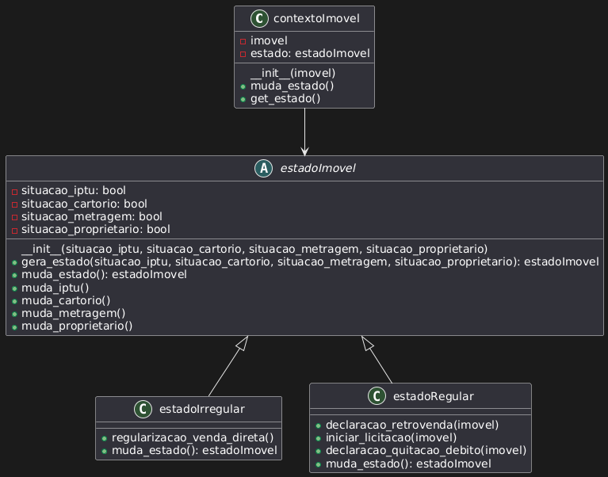

<!-- Foco_3: Padrões de Projeto GoFs Comportamentais.

Entrega Mínima: 1 Padrão GoF Comportamental, com nível de modelagem e nível de implementação evidenciados.
Apresentação (em sala) explicando o GoF Comportamental, com: (i) rastro claro aos membros participantes (MOSTRAR QUADRO DE PARTICIPAÇÕES & COMMITS); (ii) justificativas & senso crítico sobre o padrão GOF comportamental; (iii) breve apresentação do padrão GOF comportamental elaborado, e (iv) comentários gerais sobre o trabalho em equipe. Tempo da Apresentação: +/- 5min. Recomendação: Apresentar diretamente via Wiki ou GitPages do Projeto. Baixar os conteúdos com antecedência, evitando problemas de internet no momento de exposição nas Dinâmicas de Avaliação.

A Wiki ou GitPages do Projeto deve conter um tópico dedicado ao Módulo Padrões de Projeto GoFs Comportamentais, com 1 padrão GoF Comportamental (modelagem & implementação), histórico de versões, referências, e demais detalhamentos gerados pela equipe nesse escopo.

Demais orientações disponíveis nas Diretrizes (vide Moodle). -->
# <a>*GoFs Comportamentais*</a>

## <a>*Introdução*</a>

Artefato de especificação do GoF Comportamental de padrão State implementado pelo subgrupo [Whiskey](../../Subgrupos/Whiskey.md).

## <a>*Metodologia*</a>

O subgrupo [Whiskey](../../Subgrupos/Whiskey.md) se reuniu para discutir e viualizar os diversos padrões de projeto GoFs Comportamentais, com o objetivo de apresentar um padrão GoF Comportamental, com nível de modelagem e nível de implementação que possam ser utilizados na melhoria da plataforma da Terracap. Nesta reunião, após discutir e analisar os padrões, decidimos modelar e implementar os seguintes padrões:

* State
* Observer


## <a>*Padrão State*</a>

Decidimos modelar e implementar 

### <a>*Modelagem*</a>
<center>


Figura 1 - Diagrama de classes do padrão State[2]
</center>
### <a>*Implementação*</a>

Para a implementação do padrão, foi utilizado a linguagem de programação Python e os arquivos individuais de cada classe estao disponíveis na pasta `./srcState` .

```python
class contextoImovel:
        
    def __init__(self, imovel):
        self.imovel = imovel
        self.estado = estadoImovel.gera_estado(True, True, True, True)
    
    def muda_estado(self):
        self.estado = self.estado.muda_estado()

    def get_estado(self):
        return self.estado
```

* A classe contextoImovel possui métodos para mudar e verificar o estado atual do imóvel

```python
class estadoImovel(ABC):
    def __init__(self, situacao_iptu, situacao_cartorio, situacao_metragem, situacao_proprietario):
        self.situacao_iptu = situacao_iptu
        self.situacao_cartorio = situacao_cartorio
        self.situacao_metragem = situacao_metragem
        self.situacao_proprietario = situacao_proprietario

    @classmethod
    def gera_estado(cls, situacao_iptu, situacao_cartorio, situacao_metragem, situacao_proprietario):
        estado
        if(situacao_cartorio == True and situacao_iptu == True and 
           situacao_metragem == True and situacao_proprietario == True):
            estado =  estadoRegular(situacao_iptu, situacao_cartorio, situacao_metragem, situacao_proprietario)
        else:
            estado = estadoIrregular(situacao_iptu, situacao_cartorio, situacao_metragem, situacao_proprietario)
        return estado
    def muda_estado():
        pass

    def muda_iptu(self):
        if(self.situacao_iptu == False):
            self.situacao_iptu = True
        else:
            self.situacao_iptu = False
    def muda_cartorio(self):
        if(self.situacao_cartorio == False):
            self.situacao_cartorio = True
        else:
            self.situacao_cartorio = False
    def muda_metragem(self):
        if(self.situacao_metragem == False):
            self.situacao_metragem = True
        else:
            self.situacao_metragem = False
    def muda_proprietario(self):
        if(self.situacao_proprietario == False):
            self.situacao_proprietario = True
        else:
            self.situacao_proprietario = False
```

* A classe estadoImovel é a responsavel por gerar o estado do imóvel com todos os atributos relacionados a ele.


```python
class estadoIrregular(estadoImovel):
    def __init__(self, situacao_iptu, situacao_cartorio, situacao_metragem, situacao_proprietario):
        super().__init__(situacao_iptu, situacao_cartorio, situacao_metragem, situacao_proprietario)
    
    def regularizacao_venda_direta():
        pass
    def muda_estado(self):
        if(self.situacao_cartorio == True and self.situacao_iptu == True and 
           self.situacao_metragem == True and self.situacao_proprietario == True): 
            return estadoImovel.gera_estado(self.situacao_cartorio, self.situacao_iptu, self.situacao_metragem, self.situacao_proprietario)
        else:
            return self
```

* A classe estadoIrregular define todos os métodos e atributos de um imóvel irregular.

```python
class estadoRegular(estadoImovel):
    def __init__(self, situacao_iptu, situacao_cartorio, situacao_metragem, situacao_proprietario):
        super().__init__(situacao_iptu, situacao_cartorio, situacao_metragem, situacao_proprietario)

    def declaracao_retrovenda(imovel):
        pass
    def iniciar_licitacao(imovel):
        pass
    def declaracao_quitacao_debito(imovel):
        pass
    def muda_estado(self):
        if(self.situacao_cartorio == True and self.situacao_iptu == True and 
            self.situacao_metragem == True and self.situacao_proprietario == True): 
            return self
        else:
            return estadoImovel.gera_estado(self.situacao_cartorio, self.situacao_iptu, self.situacao_metragem, self.situacao_proprietario)
```

* A classe estadoRegular define todos os métodos e atributos de um imóvel regular.


## <a>*Bibliografia*</a>

    1. Jones Roberto Nuzzi, Design Patterns — Parte 2 — Os Padrões do GOF, 2019, Medium, Disponível em: <https://medium.com/design-pattern-pt/design-patterns-parte-2-os-padroes-do-gof-d7c0a0d5b5e>
    2. PLANTUML. PlantUML. Disponível em: <https://www.plantuml.com/>. Acesso em: 23 jul. 2024.

## <a>*Histórico de Versão (do template)*</a>

Favor não copiar o histórico de versão dobrado, essa seção é apenas para rastrear o template de artefato

| Versão |    Data    |       Descrição       |            Autor(es)             |           Revisor(es)            |
| :----: | :--------: | :-------------------: | :------------------------------: | :------------------------------: |
| `1.0`  | 23/07/2024 | Confecção do artefato | [Whiskey](../../Subgrupos/Whiskey.md) | [Foxtrot](../../Subgrupos/Foxtrot.md) |
| `1.1`  | 24/07/2024 | Adição dos diagramas  | [Whiskey](../../Subgrupos/Whiskey.md) | [Foxtrot](../../Subgrupos/Foxtrot.md) |
| `1.2`  | 24/07/2024 |        Revisão                     | [Foxtrot](../../Subgrupos/Foxtrot.md) | [Foxtrot](../../Subgrupos/Foxtrot.md) |