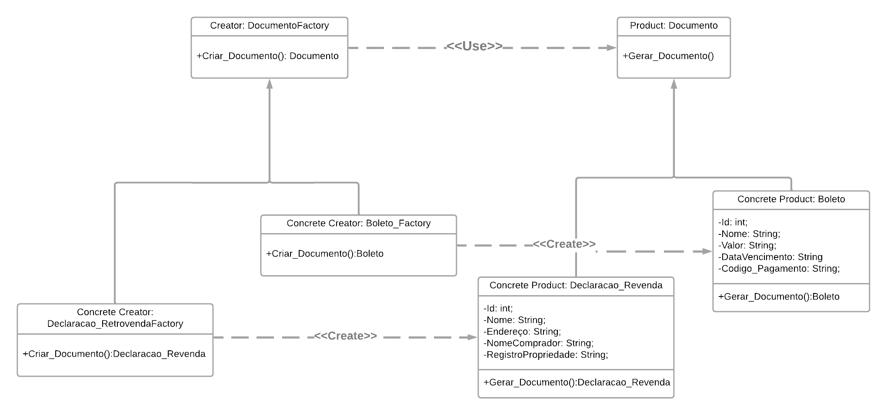

# <a>*Factory Method*</a>

## <a>*Introdução*</a>

O Factory Method é um padrão de projeto criacional que define uma interface para criar um objeto, mas permite que as subclasses alterem o tipo de objeto que será criado. Ele promove o princípio aberto/fechado, permitindo a extensão do código sem modificá-lo. O Factory Method é útil quando a classe não pode antecipar a classe dos objetos que deve criar ou quando uma classe deseja que suas subclasses especifiquem esses objetos.

Beneficios do factory Method:

- Desacoplamento: A lógica de criação de documentos é desacoplada da lógica de negócios.
- Extensibilidade: Adicionar novos tipos de documentos é fácil e não requer mudanças nas partes existentes do sistema.
- Manutenibilidade: Centralizar a lógica de criação de documentos facilita a manutenção e o entendimento do código.


## <a>*Metodologia*</a>

Na aplicação, utilizamos o padrão de projeto Factory Method para gerenciar a criação de diferentes tipos de documentos, como declarações de retrovenda e boletos. Centralizamos a lógica de criação de documentos na classe abstrata Documento Factory, que define um método Create_Documento a ser implementado por suas subclasses concretas, Declaracao_RetrovendaFactory e Boleto_Factory. Essas fábricas concretas são responsáveis por instanciar os documentos específicos (declaração de retrovenda e boleto), cada um com seus atributos particulares. Esse padrão nos permite adicionar novos tipos de documentos conforme necessidade futura, de maneira flexível mantendo a coesão e a organização do código, além de facilitar a manutenção e a extensão da aplicação.

## <a>*Modelagem*</a>




## <a>*Implementação*</a>

```python
from abc import ABC, abstractmethod
from fpdf import FPDF

# Classe Produto
class Documento(ABC):
    @abstractmethod
    def gerar_documento(self, filename):
        pass
    
    @abstractmethod
    def mock_document(self):
        pass

# Produto Concreto: Boleto
class Boleto(Documento):
    def __init__(self, id, nome, valor, data_vencimento, codigo_pagamento):
        self.id = id
        self.nome = nome
        self.valor = valor
        self.data_vencimento = data_vencimento
        self.codigo_pagamento = codigo_pagamento

    def gerar_documento(self, filename):
        pdf = FPDF()
        pdf.add_page()
        pdf.set_font("Arial", size=12)
        pdf.cell(200, 10, txt=f'Boleto: {self.nome}', ln=True, align='C')
        pdf.cell(200, 10, txt=f'Valor: {self.valor}', ln=True, align='L')
        pdf.cell(200, 10, txt=f'Vencimento: {self.data_vencimento}', ln=True, align='L')
        pdf.cell(200, 10, txt=f'Código de Pagamento: {self.codigo_pagamento}', ln=True, align='L')
        pdf.output(filename)
    
    def mock_document(self):
        return {
            "id": self.id,
            "nome": self.nome,
            "valor": self.valor,
            "data_vencimento": self.data_vencimento,
            "codigo_pagamento": self.codigo_pagamento
        }

# Produto Concreto: Declaracao_Revenda
class Declaracao_Revenda(Documento):
    def __init__(self, id, nome, endereco, nome_comprador, registro_propriedade):
        self.id = id
        self.nome = nome
        self.endereco = endereco
        self.nome_comprador = nome_comprador
        self.registro_propriedade = registro_propriedade

    def gerar_documento(self, filename):
        pdf = FPDF()
        pdf.add_page()
        pdf.set_font("Arial", size=12)
        pdf.cell(200, 10, txt=f'Declaração de Revenda: {self.nome}', ln=True, align='C')
        pdf.cell(200, 10, txt=f'Endereço: {self.endereco}', ln=True, align='L')
        pdf.cell(200, 10, txt=f'Comprador: {self.nome_comprador}', ln=True, align='L')
        pdf.cell(200, 10, txt=f'Registro: {self.registro_propriedade}', ln=True, align='L')
        pdf.output(filename)
    
    def mock_document(self):
        return {
            "id": self.id,
            "nome": self.nome,
            "endereco": self.endereco,
            "nome_comprador": self.nome_comprador,
            "registro_propriedade": self.registro_propriedade
        }

# Criador
class DocumentoFactory(ABC):
    @abstractmethod
    def criar_documento(self):
        pass

# Criador Concreto: Boleto_Factory
class Boleto_Factory(DocumentoFactory):
    def criar_documento(self):
        return Boleto(1, 'Conta de Luz', '100,00', '30/07/2024', '123456')

# Criador Concreto: Declaracao_RetrovendaFactory
class Declaracao_RetrovendaFactory(DocumentoFactory):
    def criar_documento(self):
        return Declaracao_Revenda(2, 'Revenda de Imóvel', 'Rua A, 123', 'João Silva', 'AB123456')

# Cliente
def client_code(factory: DocumentoFactory, mock=False, filename=None):
    documento = factory.criar_documento()
    if mock:
        return documento.mock_document()
    else:
        if filename:
            documento.gerar_documento(filename)
            return f'Documento gerado: {filename}'
        else:
            raise ValueError("Filename deve ser fornecido para gerar um documento PDF.")

# Código de teste
if __name__ == "__main__":
    print("Teste Boleto_Factory (Mock):")
    print(client_code(Boleto_Factory(), mock=True))
    
    print("\nTeste Declaracao_RetrovendaFactory (Mock):")
    print(client_code(Declaracao_RetrovendaFactory(), mock=True))
    
    print("\nGerando PDF com Boleto_Factory:")
    print(client_code(Boleto_Factory(), filename="boleto.pdf"))
    
    print("\nGerando PDF com Declaracao_RetrovendaFactory:")
    print(client_code(Declaracao_RetrovendaFactory(), filename="declaracao_revenda.pdf"))
```

## <a>*Conclusão*</a>

Com o uso do padrão de projeto Factory Method, conseguimos organizar e gerenciar eficientemente a criação de diferentes tipos de documentos na aplicação TerraCap. Este padrão oferece vários benefícios, como desacoplamento, extensibilidade e manutenibilidade, ao centralizar a lógica de criação de documentos e delegar a responsabilidade de instanciar objetos específicos para subclasses concretas. Dessa forma, a aplicação se torna mais flexível e adaptável a mudanças futuras, permitindo a adição de novos tipos de documentos sem a necessidade de modificar o código existente. A implementação do Factory Method, portanto, contribui significativamente para a manutenção da coesão e da organização do código, facilitando o desenvolvimento e a extensão contínua da aplicação.


## <a>*Bibliografia*</a>

    SERRANO. MILENE, AULA - GoFs Criacionais, Universidade de Brasília, 2024

    Gamma, Erich, Richard Helm, Ralph Johnson, e John Vlissides.Design Patterns: Elements of Reusable Object-Oriented Software*. Addison-Wesley, 1994.

<Center>

## <a>*Histórico de Versão*</a>


| Versão |    Data    |       Descrição       |            Autor(es)            | Revisor(es) |
| :----: | :--------: | :-------------------: | :-----------------------------: | :---------: |
| `1.0`  | 23/07/2024 | Confecção do artefato | [Papa](../../Subgrupos/Papa.md) |   revisor   |
