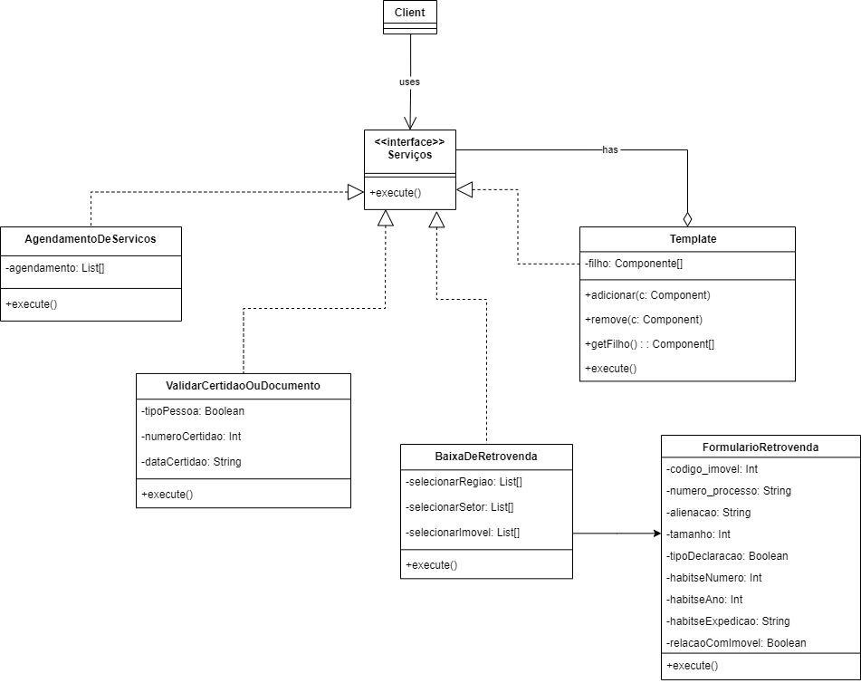

# <a> *Composite* </a>

## <a>*Introdução*</a>

O Composite é um padrão de projeto estrutural que permite que você componha objetos em estruturas de árvores e então trabalhe com essas estruturas como se elas fossem objetos individuais. <a id='anchor1'>[1](#ref1)</a>

## <a>*Metodologia*</a>

Para elaboração do artefato o subgrupo [Yankee](../../Subgrupos/Yankee.md) realizou reuniões e discussões entre os dias 17/07 até 24/07 sendo realizada a entrega no dia 25/07. Nos primeiro dia (17) foi realizado um estudo sobre o padrão e escolhido uma problemática que ele poderia resolver, no qual optamos por fazer uma adaptação do Composite com base no [Prótipo](../../Base/DesignSprint/prototipo.md) e no [Diagrama de Classe](../../Modelagem/ModelagemEstatica/DiagramaDeClasses.md). Depois entre os dias 22 a 24, foi realizada a escrita dos textos de introdução, problemática e de solução, além da construção do diagrama UML .<a id='anchor3'>[3](#ref3)</a>. Por fim no dia 24 foi dedicado para a implementação do UML em código Python.

## <a>*Problema e Solução*</a>

### Problema

O contexto de Baixa de Retrovenda foi selecionado com base nas inspirações acima, identificando o problema ao solicitar uma retrovenda e o respectivo formulário associado a ela, além das funcionalidades de Solicitar Agendamendo de Serviços e Validar Certidão ou Documento. 

### Solução

A seguir são apresentados o diagrama UML e ocódigo relativo à problemática em questão. 

## <a>*UML*</a>

 <a id='ref2'>Figura 1 - Diagrama UML </a>

    

Fonte: <a>[Yankee](../../Subgrupos/Yankee.md)</a>, 2024

O diagrama foi construído baseado na estrutura apresentada em sala de aula e com o auxílio do site [Refactoring Guru](https://refactoring.guru/pt-br/design-patterns/observer). <a id='anchor2'>[2](#ref2)</a>

## <a>*Código*</a>

## <a>*Como Rodar*</a>

## <a>*Conclusões*</a>

## <a>*Bibliografia*</a>

> <a id='ref1'>[1.](#anchor1)</a> GAMMA, Eric, et al. **Design Patterns: Elements of Reusable Object-Oriented Software.** 1rd ed. Indianapolis: Pearson Education, 1994.
>
> <a id='ref2'>2. [Refactoring Guru](https://refactoring.guru/pt-br/design-patterns/observer).
>

## <a>*Histórico de Versão*</a>

Favor não copiar o histórico de versão dobrado, essa seção é apenas para rastrear o template de artefato

| Versão |    Data    |       Descrição       | Autor(es) | Revisor(es) |
| :----: | :--------: | :-------------------: | :-------: | :---------: |
| `1.0`  | 22/07/2024 | Confecção do artefato |   [Yankee](../../Subgrupos/Yankee.md)  |   [Whiskey](../../Subgrupos/Whiskey.md)   |

