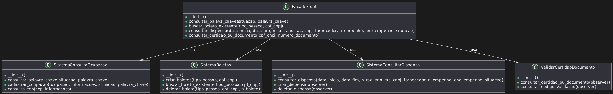

# <a>*Facade*</a>

## <a>*Introdução*</a>

O padrão de projeto Facade é um padrão estrutural que fornece uma interface simplificada para um conjunto mais complexo de interfaces em um subsistema. Ele define uma interface de nível mais alto que facilita a utilização do subsistema para os clientes. Dessa forma O principal objetivo do padrão Facade é esconder a complexidade do sistema e fornecer uma interface mais simples e fácil de usar.

Além disso, o padrão Facade é especialmente útil quando um sistema é muito complexo ou difícil de entender e o cliente precisa interagir com muitas classes diferentes. Ele ajuda a reduzir a dependência entre o cliente e as classes do subsistema, promovendo uma separação mais clara das responsabilidades.

Sendo assim, no contexto do site da Terracap, o padrão Facade foi utilizado

## <a>*Metodologia*</a>

O grupo analisou vários padrões de projeto GoF, considerando suas vantagens e desvantagens no contexto do site da Terracap, um dos padrões discutido foi o facade, que possui as seguintes vantagens e desvantagens:

- Vantagens: Simplifica a integração de novos módulos e funcionalidades no site da Terracap, tornando mais fácil para os usuários finais navegarem e utilizarem as funcionalidades oferecidas, além de que reduz o acoplamento entre o cliente e os componentes do sistema. Isso melhora a modularidade e facilita a manutenção.
- Desvantagens: Como o subsistema está encapsulado no Façade, o cliente não conhece o subsistema e seus componentes, logo não pode customizar o subsistema e seus componentes diretamente. Além disso é possível esconder funcionalidades importantes se não for bem projetado.

De acordo com o livro "Design Patterns: Elements of Reusable Object-Oriented Software", quando um sistema se torna complexo com muitas classes e suas interações, os clientes do sistema podem se tornar sobrecarregados com detalhes. Sem uma interface simplificada, os clientes precisam lidar com a complexidade diretamente, o que aumenta a chance de erros e dificulta a manutenção. Como  isso se aplica ao site da Terracap, decidimos como grupo realizar um facade para contornar esse problema, expondo  métodos simples que o cliente pode usar para realizar operações necessárias, delegando chamadas apropriadas para os componentes internos do subsistema.

Após a decisão, o subgrupo se reuniu em uma reunião no Discord e utilizou o liveshare do VScode para a confecção da escrita e do código do artefato, além de utilizar a plataforma plantuml para a confecção do diagrama

## <a>*Modelagem*</a>

<center> 


Figura 1 - Diagrama de classes do padrão Facade
</center>

## <a>*Implementação*</a>

Para implementação foi utilizada a linguagem python

No exemplo a baixo temos quatro classes que reprensentam partes complexas do sistema com funções que desempenham papéis diversos para o funcionamento do sistema, contudo nem todos esses métodos podem ser chamados diretamente pela classe de interface do usuário, seja ele um subsistema externo ou o próprio usuário final. 


### SistemaConsultaOcupacao
A classe abaixo gerencia consultas relacionadas à ocupação de imóveis ou terrenos, permitindo consultar informações sobre ocupações usando uma palavra-chave específica, cadastrar novas ocupações no sistema, e consultar informações sobre ocupações usando o CEP

```python
class SistemaConsultaOcupacao():
    def __init__(self):
        
    def consultar_palavra_chave(situacao, palavra_chave):  ### FACADE USA ESSA 
        result = 'do something'
		return result
     
    def cadastrar_ocupacao(ocupacao, informacoes, situacao, palavra_chave):
        result = 'do something'
		return result

    def consulta_cep(cep, informacoes):
        result = 'do something'
		return result
```
### SistemaBoletos
Essa classe gerencia a criação e manipulação de boletos de pagamento, permitindo Criar novos boletos de pagamento para uma pessoa ou empresa, identificada pelo tipo e CPF/CNPJ,  Buscar boletos existentes para uma pessoa ou empresa específica, e deletar um boleto específico baseado no número do boleto.

```python
class SistemaBoletos():
    def __init__(self):

    def criar_boletos(tipo_pessoa, cpf_cnpj): ### FACADE USA ESSA 
    	result = 'do something'
		return result
     
	def buscar_boleto_existente(tipo_pessoa, cpf_cnpj):
    	result = 'do something'
		return result

    def deletar_boleto(tipo_pessoa, cpf_cnpj, n_boleto):
        result = 'do something'
		return result
```

### SistemaConsultarDispensa
Essa classe gerencia consultas e operações relacionadas a dispensas de licitações ou contratos, permitindo Consultar dispensas baseadas em vários critérios como data, número e ano do RAC, CNPJ, fornecedor, etc, criar e deletar uma nova dispensa do sistema.

```python
class SistemaConsultarDispensa():
    def __init__(self):

    def consultar_dispensa(data_inicio, data_fim, n_rac, ano_rac, cnpj, fornecedor, n_empenho, ano_empenho, situacao):  
    	result = 'do something'
		return resultg
     
    def criar_dispensa(self, observer):
    	result = 'do something'
		return result

    def deletar_dispensa(self, observer):
        result = 'do something'
		return result
```
### ValidarCertidaoDocumento
Essa classe gerencia a validação de certidões e documentos, permitindo Consultar a validade de uma certidão ou documento específico e consultar um documento específico usando um código de validação.

```python
class ValidarCertidaoDocumento():
    def __init__(self):

    def consultar_certidao_ou_documento(self, observer):
        result = 'do something'
		return result
        
    def consultar_codigo_validacao(self, observer):
    	result = 'do something'
		return result
```

### FacadeFront
Com base nessas classes, podemos criar um Facade que irá abstrair apenas os métodos que podem ser chamados diretamente pelo usuário, ou seja, seriam os métodos que podemos encontrar no portal https://servicosonline.terracap.df.gov.br/gso-web-cliente/#/.

```python 
class FacadeFront():
    def __init__(self):
        self._sistemaConsultaOcupacao_sistemaConsultaOcupacao = SistemaConsultaOcupacao()
		self._sistemaBoletos = SistemaBoletos()
		self._sistemaConsultarDispensa = SistemaConsultarDispensa()
		self._validarCertidaoDocumento = ValidarCertidaoDocumento()

    def consultar_palava_chave(self, situacao, palavra_chave):
        response = self._sistemaConsultaOcupacao.ConsultarPalavraChave(situacao, palavra_chave)
		return response
		
    def buscar_boleto_existente(self, tipo_pessoa, cpf_cnpj):
    	response = self._sistemaBoletos.criar_boletos(tipo_pessoa, cpf_cnpj):
		return response
		
    def consultar_dispensa(self, data_inicio, data_fim, n_rac, ano_rac, cnpj, fornecedor, n_empenho, ano_empenho, situacao):
    	response = self._sistemaConsultarDispensa.consultar_dispensa(data_inicio, data_fim, n_rac, ano_rac, cnpj, fornecedor, n_empenho, ano_empenho, situacao)
		return response
		
    def consultar_certidao_ou_documento(self, cpf_cnpj, numero_documento):
       response = self._validarCertidaoDocumento.consultar_cpf(cpf_cnpj, numero_documento)
		return response
```

## Exemplo de uso

Um exemplo prático do uso do Facade, seria: 

```python
class Start():
	def __init__(self):
	
	def button_consultar_ocupacao(situacao, palavra_chave):
		facade_front = FacadeFront()
		response = facade_front.consultar_palava_chave(situacao, palavra_chave)
		return response
```

## <a>*Bibliografia*</a>

     "Design Patterns: Elements of Reusable Object-Oriented Software" 
     DEVMEDIA. Padrão de Projeto Facade em Java. Disponível em: https://devmedia.com.br/padrao-de-projeto-facade-em-java/26476. Acesso em: 23 jul. 2024.
     
     PADRÕES DE PROJETO. Desvantagens do Padrão Facade. Disponível em: http://www.labies.uff.br/padroesdr/questions/3/idea/8#:~:text=Desvantagens,subsistema%20e%20seus%20componentes%20diretamente. Acesso em: 23 jul. 2024.

     "plantUML"
     Disponível em: https://www.plantuml.com/ Acesso em: 24 jul. 2024.


<Center>

## <a>*Histórico de Versão*</a>

| Versão |    Data    |       Descrição       | Autor(es)                                 | Revisor(es)                               | 
| :----: | :--------: | :-------------------: | :-------:                                 | :---------:                               |
| `1.0`  | 24/07/2024 | Confecção do artefato |   [Foxtrot](../../Subgrupos/Foxtrot.md)   |   [Whiskey](../../Subgrupos/Whiskey.md)   |
