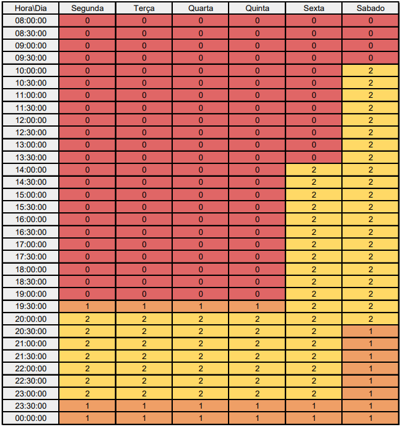

# <a>*Subgrupo Foxtrot*</a>

## <a>*Participantes*</a>

Subgrupo liderado pelo aluno [Renann de Oliveira Gomes](https://github.com/NyndoND)

| **Matrícula** |                             **Aluno**                              |
| :-----------: | :----------------------------------------------------------------: |
|   211043610   |     [Arthur Marmo Cathalá](https://github.com/artmarmocathala)     |
|   211043718   |   [Paulo Victor Fonseca Sousa](https://github.com/PauloVictorFS)   |
|   200043030   |       [Renann de Oliveira Gomes](https://github.com/NyndoND)       |

## <a>*Heatmap do Subgrupo*</a>

## <a>*Histórico de Versão*</a>

| Versão |    Data    |      Descrição       |                      Autor                       | Revisor |
| :----: | :--------: | :------------------: | :----------------------------------------------: | :-----: |
|  1.0   | 07/04/2024 | Artefato do subgrupo | [João Lucas](https://github.com/VasconcelosJoao) |  [Foxtrot](/Subgrupos/Foxtrot)   |

