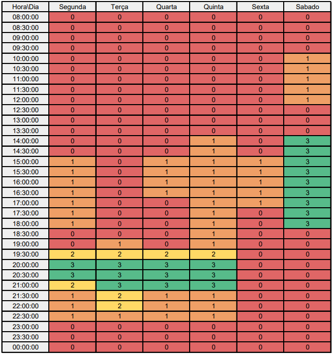

# <a>*Subgrupo Papa*</a>

## <a>*Participantes*</a>

Subgrupo liderado pelo aluno [Fause Carlos](https://github.com/FauseSkyWalker)

| **Matrícula** |                            **Aluno**                             |
| :-----------: | :--------------------------------------------------------------: |
|   211061494   |    [Bruno Tarquinio Silva](https://github.com/brunotarquinio)    |
|   211031691   |        [Fause Carlos](https://github.com/FauseSkyWalker)         |
|   200059947   | [Pedro Henrique Muniz de Oliveira](https://github.com/Muniz2811) |

## <a>*Heatmap do Subgrupo*</a>

Figura 1: Mapa de calor

## <a>*Histórico de Versão*</a>

| Versão |    Data    |      Descrição       |                      Autor                       |         Revisor         |
| :----: | :--------: | :------------------: | :----------------------------------------------: | :---------------------: |
| `1.0`  | 07/04/2024 | Artefato do subgrupo | [João Lucas](https://github.com/VasconcelosJoao) | [Papa](Papa.md) |

