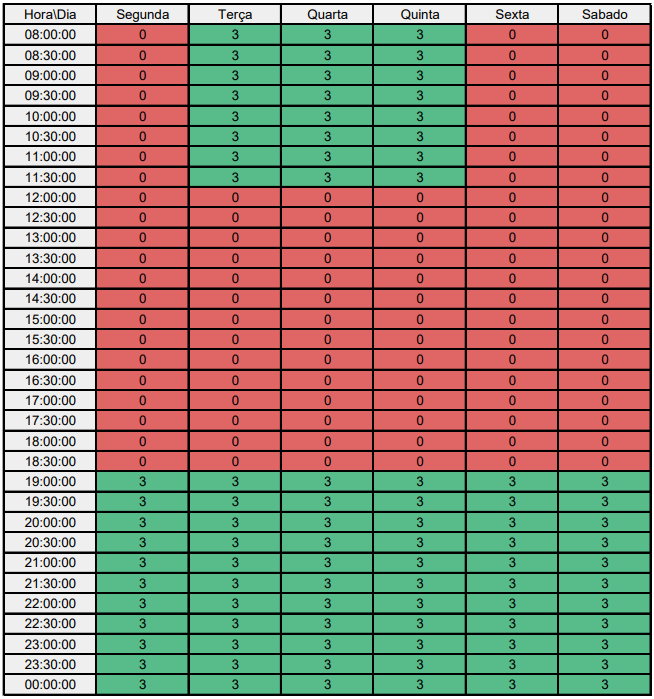

# <a>*Subgrupo Yankee*</a>

## <a>*Participantes*</a>

Subgrupo liderado pelo aluno [Gabriel Campello Marque](https://github.com/G16C)

| **Matrícula** |                          **Aluno**                          |
| :-----------: | :---------------------------------------------------------: |
|   211039250   | [Arthur Grandão de Mello](https://github.com/arthurgrandao) |
|   211039439   |     [Gabriel Campello Marque](https://github.com/G16C)      |
|   211041286   |  [Rafael Ferreira Leandro](https://github.com/RafaelCLG0)   |

## <a>*Heatmap do Subgrupo*</a>

Figura 1: Mapa de calor

## <a>*Histórico de Versão*</a>

| Versão |    Data    |      Descrição       |                      Autor                       |           Revisor           |
| :----: | :--------: | :------------------: | :----------------------------------------------: | :-------------------------: |
| `1.0`  | 07/04/2024 | Artefato do subgrupo | [João Lucas](https://github.com/VasconcelosJoao) | [Yankee](Yankee.md) |

